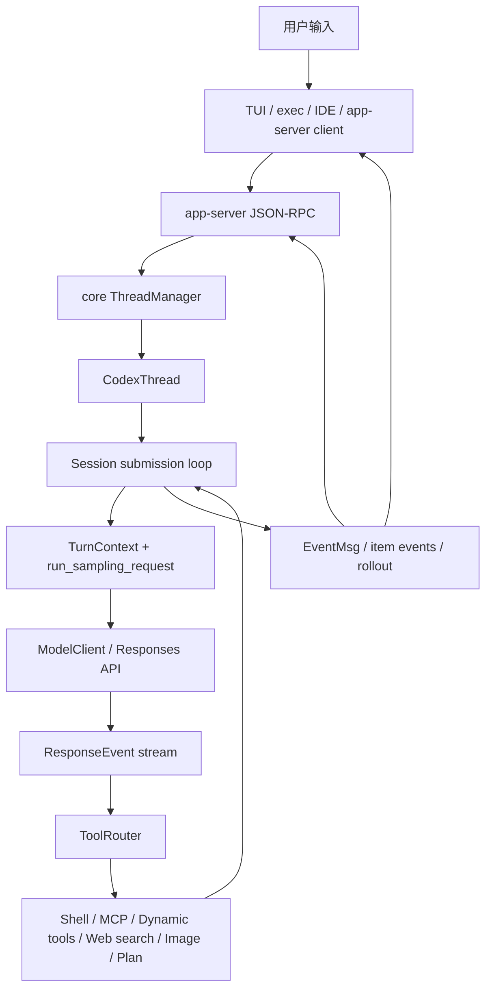

# Codex Agent 开发架构学习指南

本文基于当前仓库源码梳理 Codex 本地 agent 的完整开发架构。目标不是重复用户文档，而是帮助你从工程实现角度理解：一个用户请求如何进入系统、如何构造成模型上下文、如何调用工具、如何处理权限与沙箱、如何持久化会话，以及如何扩展成 TUI、IDE、MCP、技能、插件、多 agent 等场景。

主要源码入口：

- 顶层 CLI：`codex-rs/cli/src/main.rs`
- 交互式 TUI：`codex-rs/tui/src/lib.rs`、`codex-rs/tui/src/app.rs`、`codex-rs/tui/src/chatwidget.rs`
- app-server：`codex-rs/app-server/src/main.rs`、`codex-rs/app-server/src/message_processor.rs`
- app-server 协议：`codex-rs/app-server-protocol/src/protocol/v2/`
- 核心业务逻辑：`codex-rs/core/src/lib.rs`
- thread/session/turn：`codex-rs/core/src/thread_manager.rs`、`codex-rs/core/src/codex_thread.rs`、`codex-rs/core/src/session/`
- 模型客户端：`codex-rs/core/src/client.rs`
- 工具路由：`codex-rs/core/src/tools/`
- shell 执行与沙箱：`codex-rs/core/src/exec.rs`、`codex-rs/core/src/sandboxing/`
- MCP 连接管理：`codex-rs/codex-mcp/src/connection_manager.rs`
- 技能：`codex-rs/core/src/skills.rs`、`codex-rs/core-skills/`
- 多 agent：`codex-rs/core/src/agent/`
- 线程持久化：`codex-rs/thread-store/src/lib.rs`、`codex-rs/core/src/rollout.rs`

## 1. 总体架构

Codex 的 agent 架构可以分为五层：

1. **产品入口层**：CLI、TUI、`codex exec`、`codex app-server`、桌面 app 启动器、IDE 扩展等。
2. **客户端协议层**：app-server 使用 JSON-RPC v2，把富客户端的 `thread/start`、`turn/start`、审批、文件、进程、MCP、技能、插件等 RPC 转成核心操作。
3. **核心 agent 层**：`codex-core` 管理 thread/session/turn、上下文、模型采样、工具调用、审批、沙箱、MCP、持久化、多 agent。
4. **外部能力层**：模型 provider、Responses API/WebSocket、MCP server、工具执行、文件系统、插件、技能、hooks、exec-server、网络代理。
5. **状态与观测层**：rollout 记录、thread-store、state db、analytics、OpenTelemetry、事件流、token usage。

简化链路如下：



这个设计的核心是 **SQ/EQ 模型**：用户和客户端向 core 提交 `Submission { id, op, trace }`，core 异步产出 `Event { id, msg }`。协议定义在 `codex-rs/protocol/src/protocol.rs`，其中 `Op` 是输入操作队列，`EventMsg` 是输出事件队列。

## 2. 工作区与 crate 分工

`codex-rs/Cargo.toml` 是 Rust workspace 的总表，crate 名遵循 `codex-*` 前缀。与 agent 开发最相关的 crate 可以按职责理解：

- `codex-cli`：顶层命令解析与分发。没有子命令时进入交互式 TUI；`exec` 进入非交互模式；`app-server` 暴露 JSON-RPC 服务；`mcp-server` 让 Codex 自身成为 MCP server。
- `codex-tui`：终端 UI。它现在通过 app-server client 驱动会话，而不是直接手写一套 core 调用路径。
- `codex-exec`：非交互 agent 运行。负责严格控制 stdout/stderr，支持 human/jsonl 输出。
- `codex-app-server`：IDE、TUI、桌面等富客户端的中间层。它维护连接状态、初始化握手、请求分发、通知过滤、thread 状态映射。
- `codex-app-server-protocol`：app-server v2 的 Rust 类型、TypeScript/schema 导出、JSON-RPC 消息模型。
- `codex-core`：业务逻辑中心。负责从配置、用户输入、历史、工具、MCP、技能构造模型请求，并把模型响应转成事件、工具调用和持久化记录。
- `codex-protocol`：core 内部协议，定义 `Op`、`EventMsg`、审批事件、sandbox policy、turn item 等。
- `codex-api`、`codex-client`、`codex-model-provider*`：模型 provider 与 API 传输抽象。
- `codex-mcp`、`codex-rmcp-client`、`codex-mcp-server`：MCP 客户端/服务端集成。
- `codex-tools` 与 `core/src/tools`：工具规格生成、工具注册和运行时调度。
- `codex-thread-store`、`codex-rollout`、`codex-state`：会话与线程状态持久化。
- `codex-config` 与 `core/src/config`：配置层合并、权限 profile、模型 provider、MCP、插件、技能等运行配置。

一个重要工程判断：`codex-core` 已经很大，仓库说明明确要求抵制继续把新概念塞进 `codex-core`。做扩展时优先判断是否应该落在 app-server、protocol、tools、mcp、config、plugin、skills、thread-store 等更窄的 crate。

## 3. 从命令行到运行时

### 3.1 CLI 命令分发

入口文件 `codex-rs/cli/src/main.rs` 使用 `clap` 定义 `MultitoolCli` 和 `Subcommand`。主要路径：

- 无子命令：进入交互式 TUI。
- `codex exec` / `codex e`：进入 `codex-exec`，用于非交互运行。
- `codex review`：进入 review 模式。
- `codex app-server`：启动 JSON-RPC app-server。
- `codex mcp`：管理外部 MCP server。
- `codex mcp-server`：把 Codex 自身作为 MCP server。
- `codex resume` / `codex fork`：恢复或 fork 既有 thread。
- `codex sandbox`：调试平台沙箱。

CLI 层的原则是：解析参数、加载配置、选择产品入口，不直接承载 agent 推理逻辑。

### 3.2 TUI

`codex-rs/tui/src/lib.rs` 声明了大量 UI 模块，并通过 `AppServerSession` 与 app-server 通信。`App::run` 在 `codex-rs/tui/src/app.rs` 中完成启动流程：

- 初始化 terminal、事件通道、配置提示、迁移提示。
- `app_server.bootstrap(&config)` 获取模型、账号、能力等启动数据。
- 根据 `SessionSelection` 选择 `start_thread`、resume 或 fork。
- 构造 `ChatWidget`，将用户输入、模型事件、审批 UI、工具输出、plan/review/goal 状态映射到终端界面。

TUI 的 `chatwidget.rs` 很大，职责集中在 UI 状态机：输入队列、agent turn running 状态、MCP startup 状态、计划模式、copyable markdown、审批弹窗、工具项展示、turn 完成/中断恢复等。

### 3.3 非交互 exec

`codex-rs/exec/src/lib.rs` 是 `codex exec` 的入口。它同样通过 `InProcessAppServerClient` 创建 app-server，而不是绕过协议层直接调 core。exec 的特殊点：

- stdout 必须只输出最终消息或 JSONL 事件。
- stderr 用于日志和人类可读进度。
- 支持 `--json`，把 thread/turn/item 事件整理成稳定 JSONL。
- 支持从 stdin、位置参数、图片、输出 schema 构造一次性 `turn/start`。

这说明 app-server 已经是 Codex 多产品入口共享的主集成边界。

## 4. app-server 协议层

app-server 的定位见 `codex-rs/app-server/README.md`：它给 IDE、桌面、TUI 这类富客户端提供 JSON-RPC 2.0 风格接口。核心 primitive 是：

- **Thread**：一段会话。
- **Turn**：用户和 agent 的一次交互。
- **Item**：turn 内的具体输入、输出、推理、工具调用、文件变更等。

### 4.1 连接生命周期

app-server 支持 stdio、websocket、unix socket、off 等 transport。连接必须先调用 `initialize`，再发 `initialized`。连接状态由 `MessageProcessor` 中的 `ConnectionSessionState` 管理：

- 是否 initialized。
- 是否启用 experimental API。
- opt-out 的通知方法列表。
- client name/version。

请求进入 `MessageProcessor` 后按 `ClientRequest` 类型分发到不同 processor：

- `InitializeRequestProcessor`
- `ThreadRequestProcessor`
- `TurnRequestProcessor`
- `CommandExecRequestProcessor`
- `McpRequestProcessor`
- `ConfigRequestProcessor`
- `FsRequestProcessor`
- `AppsRequestProcessor`
- `PluginRequestProcessor`
- `ThreadGoalRequestProcessor`

### 4.2 thread/start 与 turn/start

app-server thread API 负责创建、恢复、fork、列出、归档 thread。`ThreadRequestProcessor` 处理持久化、过滤、resume override、动态工具校验等。

`TurnRequestProcessor::turn_start_inner` 是富客户端发起模型交互的关键入口：

1. 校验输入大小。
2. 根据 `threadId` 找到 `CodexThread`。
3. 保存 app-server client metadata。
4. 解析 collaboration mode、environment selections。
5. 把 v2 `UserInput` 映射成 core input item。
6. 判断是否有 cwd、approval、sandbox、permissions、model、effort、summary、service_tier、personality 等 turn 级 override。
7. 如果同时传 `sandboxPolicy` 和 `permissions`，拒绝请求。
8. 若提供 permissions，加载配置并解析成 `PermissionProfile` 与 `ActivePermissionProfile`。
9. 调用 `thread.validate_turn_context_overrides(...)` 做同步校验。
10. 构造 core `Op::UserInput` 或 `Op::UserInputWithTurnContext`。
11. `submit_core_op` 把 op 提交到 `CodexThread`。
12. 记录 request 到 turn id 的映射，并返回 `TurnStartResponse`。

这个过程很重要：app-server 负责 API 边界校验和请求语义，core 负责按提交顺序执行。

### 4.3 事件与通知

core 产生的是 `codex_protocol::protocol::EventMsg`。app-server 再映射为 v2 notification/request：

- `turn/started`
- `item/started`
- `item/completed`
- `item/agentMessage/delta`
- `item/tool/call`
- `turn/completed`
- 审批请求、MCP elicitation、rate limit、goal update、thread status 等。

这个映射让 UI 不必理解 core 内部所有事件细节，也让 schema 可以稳定导出 TypeScript。

## 5. core：ThreadManager、CodexThread、Session

`codex-core` 的公开根在 `codex-rs/core/src/lib.rs`。它显式导出 `ThreadManager`、`CodexThread`、`ModelClient`、`McpManager`、rollout/thread-store 相关能力等。

### 5.1 ThreadManager

`codex-rs/core/src/thread_manager.rs` 的 `ThreadManager` 负责：

- 创建新 thread。
- resume/fork 持久化 thread。
- 维护内存中的 `HashMap<ThreadId, Arc<CodexThread>>`。
- 持有 `AuthManager`、`ModelsManager`、`EnvironmentManager`、`SkillsManager`、`PluginsManager`、`McpManager`、`ThreadStore`、state db 等共享服务。
- 构造 `AgentControl`，让一个 root thread 下的 sub-agent 共用 registry。
- 广播 thread 创建事件。

`StartThreadOptions` 聚合了启动一条 thread 所需的配置：`Config`、初始历史、session source、thread source、dynamic tools、环境选择、trace 等。

### 5.2 CodexThread

`codex-rs/core/src/codex_thread.rs` 的 `CodexThread` 是 app-server/TUI 与 Session 的门面：

- `submit(op)`：提交 core 操作。
- `submit_with_trace(op, trace)`：提交带 W3C trace context 的操作。
- `shutdown_and_wait()`：关停 session loop。
- `steer_input(...)`：向运行中的 turn 追加用户输入。
- `validate_turn_context_overrides(...)`：校验 turn 级 cwd、approval、sandbox、permissions、model 等。
- `config_snapshot()`：返回当前 thread 配置快照。
- `inject_response_items(...)`：直接注入 Responses item。
- 目标状态、thread memory mode、rollout flush、MCP resource 读取等辅助能力。

可以把它看成“一个正在运行或可恢复的 agent 会话句柄”。

### 5.3 Session 和 Submission Loop

`codex-rs/core/src/session/mod.rs` 定义 `Codex`：

```rust
pub struct Codex {
    pub(crate) tx_sub: Sender<Submission>,
    pub(crate) rx_event: Receiver<Event>,
    pub(crate) agent_status: watch::Receiver<AgentStatus>,
    pub(crate) session: Arc<Session>,
    pub(crate) session_loop_termination: SessionLoopTermination,
}
```

`Codex::spawn` 创建：

- bounded submission channel。
- unbounded event channel。
- skills、plugins、AGENTS.md、exec policy、model info、base instructions、service tier、dynamic tools。
- `SessionConfiguration`。
- `Session::new(...)`。
- 后台 `submission_loop(...)`。

`codex-rs/core/src/session/handlers.rs` 的 `submission_loop` 是 core 操作分发中心。它接收 `Op` 并调用对应 handler：

- `Op::UserInput` / `UserInputWithTurnContext` / `UserTurn`：进入 `user_input_or_turn`。
- `Op::Interrupt`：中断当前任务。
- `Op::ExecApproval` / `PatchApproval`：审批回传。
- `Op::DynamicToolResponse`：动态工具响应回传。
- `Op::RefreshMcpServers`：刷新 MCP。
- `Op::Compact`：启动压缩 turn。
- `Op::ThreadRollback`：回滚 thread。
- `Op::RunUserShellCommand`：用户 `!` shell 命令。
- `Op::ResolveElicitation`：MCP elicitation 回传。
- `Op::Review`：启动 review turn。
- `Op::Shutdown`：关闭任务、MCP、unified exec、guardian、持久化 writer。

普通用户 turn 的核心流程在 `user_input_or_turn_inner`：

1. 根据 op 提取输入 items、turn setting updates、metadata。
2. `sess.new_turn_with_sub_id(...)` 创建 turn context。
3. 尝试 `steer_input`。如果已有可 steer 的 active turn，则追加输入。
4. 如果没有 active turn，则刷新 MCP server，调用 `sess.spawn_task(...)` 启动 regular task。
5. 同步实时会话文本镜像。

## 6. Turn 执行与模型采样

`codex-rs/core/src/session/turn.rs` 是每一轮 agent 推理的核心。关键方法是 `run_sampling_request` 和 `try_run_sampling_request`。

### 6.1 构造 Prompt

每次采样前，core 会：

- 从当前历史、用户输入、上下文 manager 得到 `ResponseItem` 输入。
- 调 `built_tools(...)` 构造本轮可见工具。
- `sess.get_base_instructions()` 获取基础 instructions。
- `build_prompt(...)` 生成 `Prompt`：
  - input
  - tools
  - parallel_tool_calls
  - base_instructions
  - personality
  - output_schema

`built_tools(...)` 会综合：

- MCP server 暴露的 tools。
- Apps/connectors。
- 插件提供的 connectors。
- tool_suggest discoverable tools。
- deferred MCP/dynamic tools。
- unavailable dummy tools。
- dynamic tools。
- 当前配置中的 tools config。

### 6.2 ModelClient

`codex-rs/core/src/client.rs` 的 `ModelClient` 是 session-scoped；`ModelClientSession` 是 turn-scoped。这个分层很关键：

- `ModelClient` 持有 auth、provider、thread id、installation id、WebSocket fallback 状态等。
- `ModelClientSession` 每个 turn 新建，持有 Responses WebSocket connection、上一请求、上一响应、`x-codex-turn-state` sticky routing token。

`try_run_sampling_request` 通过 `client_session.stream(...)` 获取 `ResponseEvent` 流，支持 WebSocket 与 HTTPS fallback、retry/backoff、stream error notification、rate limit 更新、models etag refresh 等。

### 6.3 流式事件处理

`try_run_sampling_request` 对不同 `ResponseEvent` 做处理：

- `OutputItemAdded`：发出 item started；assistant 文本进入流式 parser；工具参数 delta 建立 diff consumer。
- `OutputTextDelta`：转成 agent message delta。
- `ReasoningSummaryDelta` / `ReasoningContentDelta`：转成 reasoning delta。
- `OutputItemDone`：调用 `handle_output_item_done`，决定是否是工具调用。
- `Completed`：更新 token usage、判断 `end_turn`、发 turn diff。
- `RateLimits`：更新 rate limit。
- `ServerModel`、`ModelVerifications`、`ServerReasoningIncluded`：更新状态与提示。

如果模型产生工具调用，`handle_output_item_done` 会记录 response item，创建工具 future，并设置 `needs_follow_up = true`。工具输出会作为新的 `ResponseInputItem` 回灌给模型，直到模型完成最终回答或上下文/错误中断。

## 7. 工具系统

工具系统的主入口在 `codex-rs/core/src/tools/`。

### 7.1 ToolRouter

`core/src/tools/router.rs` 的 `ToolRouter` 持有：

- `ToolRegistry`：从工具名到处理器的注册表。
- `specs`：完整工具规格。
- `model_visible_specs`：本轮真正发给模型的工具规格。
- `parallel_mcp_server_names`：允许并行工具调用的 MCP server 集合。

`ToolRouter::build_tool_call(session, item)` 把模型输出转换成统一 `ToolCall`：

- `ResponseItem::FunctionCall`：可能是内置 function，也可能解析成 MCP tool。
- `ToolSearchCall`：客户端执行的 tool search。
- `CustomToolCall`：freeform/custom tool。
- `LocalShellCall`：Responses local shell 调用转成 `local_shell`。

`dispatch_tool_call_with_code_mode_result(...)` 再把 `ToolCall` 交给 registry 分发。

### 7.2 内置工具类型

从模块划分可以看到常见能力：

- `context`：工具调用上下文、payload、source。
- `events`：工具事件构造。
- `handlers`：具体工具 handler。
- `network_approval`：网络审批与 network policy。
- `orchestrator`：工具编排。
- `parallel`：并行工具运行时。
- `router`：模型输出到工具调用的路由。
- `runtimes`：工具运行时。
- `sandboxing`：工具权限和沙箱。
- `spec`、`spec_plan`：工具规格生成。
- `tool_search_entry`：tool search 暴露入口。
- `code_mode`：code mode 相关工具。

工具输出最终会格式化成模型可消费文本或结构化 payload。shell 输出格式化见 `core/src/tools/mod.rs` 的 `format_exec_output_for_model_structured` 和 `format_exec_output_for_model_freeform`。

### 7.3 Shell 执行与沙箱

`core/src/exec.rs` 的 `process_exec_tool_call` 负责把 shell 工具请求变成 `ExecRequest`：

1. 根据 `PermissionProfile` 推导 filesystem/network sandbox policy。
2. 选择平台 sandbox：macOS Seatbelt、Linux bubblewrap/Landlock、Windows restricted/elevated sandbox，或无沙箱。
3. 应用 network proxy/env。
4. 通过 `SandboxManager::transform(...)` 生成最终命令。
5. 调 `sandboxing::execute_env(...)` 执行。
6. 聚合 stdout/stderr、exit code、duration、timeout 状态。

这解释了为什么 agent 开发不能只关心“能不能跑命令”：命令执行是权限 profile、审批策略、平台沙箱、网络策略、输出截断和事件流共同决定的结果。

## 8. 审批、权限与安全

Codex 有两套需要区分的概念：

- **Approval policy**：是否需要用户批准，例如 on-request、never、unless-trusted 等。
- **PermissionProfile / SandboxPolicy**：实际给工具和进程的文件系统、网络、平台沙箱能力。

配置解析在 `core/src/config/mod.rs` 和 `core/src/config/permissions.rs`。`Permissions` 持有：

- `approval_policy`
- `permission_profile`
- `active_permission_profile`
- `network`
- `allow_login_shell`
- `shell_environment_policy`
- `windows_sandbox_mode`
- `windows_sandbox_private_desktop`

app-server v2 更推荐使用 `permissions` profile selection，而不是旧的 `sandboxPolicy`。`turn_start_inner` 明确禁止两者同时出现。

审批请求在 core 里通过事件发出，UI/app-server 再转给用户。用户批准后通过：

- `Op::ExecApproval`
- `Op::PatchApproval`
- `Op::RequestPermissionsResponse`
- `Op::ResolveElicitation`

回到 `submission_loop`。

对于 agent 开发，安全边界建议是：

- 新工具必须明确它需要哪些文件和网络能力。
- 尽量使用现有 `PermissionProfile`、sandboxing、approval event，不要绕开。
- 不要让工具 handler 直接做隐藏副作用；应通过事件、审批、持久化路径进入系统。
- 不要在 core library 直接写 stdout/stderr，core 和 TUI library 都用 lint 禁止。

## 9. MCP 与 Apps/Connectors

MCP 集成由 `codex-rs/codex-mcp/src/connection_manager.rs` 负责。`McpConnectionManager`：

- 维护 server name 到 async RMCP client 的映射。
- 发出 startup starting/ready/failed/cancelled 事件。
- 聚合 tools、resources、resource templates。
- 路由 tool call 到具体 MCP client。
- 处理 elicitation request。
- 记录 server metadata，比如 origin、是否 pollutes memory、是否支持 parallel tool calls。
- 支持 host-owned Codex Apps MCP server。

core 在每个 turn 的 `built_tools(...)` 中读取 MCP 工具，再根据 apps/connectors、显式 mention、skill 名冲突、插件 connector、tool_suggest 等规则筛选本轮可见工具。

Apps/connectors 的使用方式：

- app-server `app/list` 获取可用 app。
- 用户文本中出现 `$<app-slug>` 或 input item 中携带 `mention`。
- core 根据 connector slug、explicit app id、插件 connector 和可访问 MCP tools 决定是否暴露相应工具。

这套设计让“工具市场/插件/app”与“模型工具调用”之间保持解耦：前者是发现与配置，后者是每轮 prompt 的工具规格。

## 10. Skills 与 AGENTS.md

### 10.1 AGENTS.md

`core/src/agents_md.rs` 负责按 cwd 和层级读取 AGENTS.md。文档入口在 `docs/agents_md.md`。AGENTS.md 最终进入 user instructions/context fragment，用于告诉模型当前项目的开发约束。

当前仓库根目录的 `AGENTS.md` 对 Rust 开发有强约束，例如：

- Rust crate 命名。
- clippy 规则。
- 不改 sandbox 环境变量相关代码。
- API 变更要更新 docs/schema。
- TUI snapshot 测试。
- 依赖变更要更新 Bazel lock。

agent 开发时，AGENTS.md 是项目内“本地开发协议”的一部分，不是普通备注。

### 10.2 Skills

`core/src/skills.rs` 是 core 对 `codex-core-skills` 的封装：

- 根据 config 和 plugin skill roots 构造 `SkillsLoadInput`。
- 加载 system/user/repo/admin/plugin skill。
- 解析显式 `$skill-name`。
- 根据命令检测隐式 skill invocation。
- 处理 skill 依赖的环境变量，必要时通过 `request_user_input` 向用户索取。

app-server 也提供 `skills/list` 和 `skills/config/write`，让客户端展示、启停 skill。

从开发角度看，skill 更像“可被注入的开发流程知识”，MCP/tool 更像“可执行能力”。二者都可能由插件贡献，但进入模型上下文的方式不同。

## 11. Plugins

插件相关 crate 包括：

- `codex-plugin`
- `codex-core-plugins`
- `codex-utils-plugins`
- app-server 的 `PluginRequestProcessor`、`MarketplaceRequestProcessor`

插件可以贡献：

- skills roots。
- apps/connectors。
- marketplace 元数据。
- 未来更多能力入口。

core 在 session spawn 和 turn build tools 时会读取 `plugins_manager.plugins_for_config(...)`，并把插件技能 roots、connector 信息并入本轮可用上下文。

开发插件能力时，优先在插件相关 crate 或 app-server processor 中扩展，不应直接把 marketplace 或插件解析逻辑写进 turn 主循环。

## 12. 多 agent 架构

多 agent 代码在 `core/src/agent/`：

- `control.rs`：`AgentControl`，spawn/message/list/wait/close 的控制面。
- `registry.rs`：root thread 范围内的 agent registry。
- `mailbox.rs`：agent 间通信。
- `role.rs`：agent role 配置。
- `status.rs`：从事件推导 agent status。

`AgentControl` 的关键设计：

- 每个 root session tree 共享一个 `AgentControl`。
- `ThreadManagerState` 用 `Weak` 引用，避免引用环。
- spawn agent 实际上是 spawn 新 thread，可以继承 shell snapshot、exec policy。
- subagent source 中带 parent thread、depth、agent path、role。
- depth 和 max threads 受配置限制。
- fork 模式可以保留 full history 或 last N turns。

普通 root agent 与 sub-agent 的区别不在于模型能力，而在于 session source、历史构造、指令前缀、registry、mailbox 和资源限制。

## 13. 持久化：thread-store、rollout、state db

`codex-rs/thread-store/src/lib.rs` 定义 storage-neutral 接口。应用层只把 `ThreadId` 当持久 handle；具体实现可以是本地 rollout 文件、内存 store 或未来远程 store。

关键类型：

- `ThreadStore`
- `LocalThreadStore`
- `InMemoryThreadStore`
- `LiveThread`
- `StoredThread`
- `StoredTurn`
- `StoredThreadHistory`
- `ThreadPersistenceMetadata`

core 还保留 rollout 相关导出：

- `RolloutRecorder`
- `RolloutItem`
- `SessionMeta`
- `ThreadItem`
- thread list/read/archive/fork/resume 辅助函数。

持久化承担多种职责：

- resume/fork 时重建历史。
- app-server `thread/list`、`thread/read`、`thread/turns/list`。
- rollback 时从历史重放并追加 rollback marker。
- 记录 thread name、git info、memory mode、dynamic tools。
- 支撑调试、审计、token usage replay。

agent 开发中，如果新增 user-visible item、tool item、turn 状态或 metadata，必须同时考虑：

- core 事件。
- app-server v2 item 类型。
- thread-store/rollout 是否能持久化和恢复。
- TUI/exec 是否能渲染或忽略。

## 14. 配置系统

配置由 `codex-config` 加载多层来源，再由 `core/src/config/mod.rs` 构造成运行时 `Config`。重要配置面：

- 模型和 provider。
- reasoning effort/summary、service tier、verbosity、personality。
- approval policy、permission profile、sandbox。
- MCP server。
- plugins、skills。
- hooks。
- memories。
- TUI 设置。
- thread-store。
- feature flags。
- config lock 和 managed config。

配置可以来自用户文件、项目、managed config、CLI override、profile、app-server request override 等。core 中很多字段使用 `Constrained<T>`，表示它可能被管理策略限制，调用者不能简单假设“用户传了就一定生效”。

如果改 `ConfigToml` 或嵌套配置类型，应按仓库指令运行 `just write-config-schema` 更新 `codex-rs/core/config.schema.json`。

## 15. 常见用户场景与解决方案

### 场景 A：用户在 TUI 中输入“修复这个 bug”

推荐链路：

1. TUI composer 收集文本、图片、mention、skill item。
2. `AppServerSession::turn_start` 发送 app-server `turn/start`。
3. app-server 校验输入和 turn override。
4. core 创建 `TurnContext`。
5. 读取 AGENTS.md、skills、plugins、MCP、当前历史。
6. 构造 prompt 和工具 specs。
7. 模型流式输出 reasoning/assistant/tool call。
8. shell/MCP/apply_patch 等工具按权限与审批执行。
9. 工具输出回灌给模型。
10. 最终回答和 diff/tool item 持久化并渲染。

关键扩展点：

- 新 UI 行为：TUI `chatwidget.rs` 或 app-server event mapping。
- 新工具：`core/src/tools` 与 `codex-tools`。
- 新协议字段：app-server-protocol v2、schema、README。
- 新上下文注入：context manager、skills、AGENTS.md、plugins。

### 场景 B：用户通过 IDE 发起会话

推荐方案是集成 app-server，不直接嵌入 core：

1. 打开 transport。
2. `initialize` + `initialized`。
3. `thread/start` 或 `thread/resume`。
4. `turn/start`。
5. 订阅 notification，按 item lifecycle 渲染。
6. 对 server request 做响应：审批、dynamic tool、MCP elicitation、auth refresh。

这样 IDE 可以获得稳定协议、TypeScript schema、experimental opt-in、通知过滤和客户端 metadata。

### 场景 C：需要新增一种模型可调用工具

推荐实现路径：

1. 定义工具规格：放在 `codex-tools` 或 `core/src/tools/spec*`。
2. 注册 handler：放在 `core/src/tools/registry` 和相关 handler 模块。
3. 在 `ToolRouter::build_tool_call` 或 registry 中解析模型输出。
4. 明确工具 payload、审批需求、sandbox permission。
5. 输出 `ResponseInputItem` 给模型。
6. 发出 started/completed/delta 事件。
7. 确认 app-server v2 item 是否需要新类型。
8. 补 TUI/exec 渲染。
9. 补持久化恢复和测试。

不要让 handler 绕过 `ToolRouter` 或直接写 UI。

### 场景 D：需要接入外部系统

优先考虑 MCP 或 app/plugin connector，而不是直接把外部 API 写进 core：

- 如果外部系统有标准工具调用能力：做 MCP server。
- 如果是 Codex marketplace/app 形态：走 connector/app。
- 如果只是开发流程提示：做 skill。
- 如果必须是内置工具：再进入 core tools。

这样可以复用 MCP startup、auth、elicitation、tool listing、parallel tool calls 和 app-server 展示能力。

### 场景 E：需要改变权限或沙箱行为

优先从配置和 `PermissionProfile` 入手：

- app-server API：新增或调整 `permissions` profile selection。
- core config：调整 profile 解析和 constraints。
- sandboxing：调整 transform 或平台 backend。
- UI：展示 active permission profile，而非只展示旧 sandbox mode。

避免在工具 handler 里临时绕过沙箱。shell 执行应统一进入 `process_exec_tool_call` / `sandboxing::execute_env`。

### 场景 F：需要让 agent 记住或恢复会话

关注三层：

- thread-store：thread/turn/item 的 durable API。
- rollout：历史事件和 session metadata。
- context reconstruction：resume/fork/rollback 时如何重建 model-visible history。

新增历史项时，不能只让当前 turn 正常；还要验证 resume/fork/read/list/rollback 是否能理解。

### 场景 G：需要多 agent 并行分析

优先使用 `AgentControl` 的 spawn/message/wait/close 模型：

- 每个 subagent 是一个独立 thread。
- parent 和 child 通过 registry/mailbox 建立关系。
- subagent 可以继承部分 shell snapshot/exec policy。
- depth、数量、运行时受 config 限制。
- UI 通过 agent status 和 inter-agent events 展示。

如果新增多 agent 能力，不要把子任务作为普通工具输出塞进一个 turn；应该尊重 thread 边界和持久化边界。

### 场景 H：需要新增 app-server API

仓库要求 active API 开发在 v2：

- 类型放 `app-server-protocol/src/protocol/v2/`。
- 请求 payload 用 `*Params`，响应用 `*Response`，通知用 `*Notification`。
- wire 字段 camelCase。
- v2 类型 `#[ts(export_to = "v2/")]`。
- client request optional field 用 `#[ts(optional = nullable)]`。
- 新 list 方法默认 cursor pagination。
- 更新 `app-server/README.md`。
- 运行 schema generation 和 `cargo test -p codex-app-server-protocol`。

处理器实现放 app-server `request_processors/`，必要时才调用 core。

### 场景 I：需要新增 UI 展示

先判断事件来源：

- core 已有事件，只需 app-server 映射和 TUI 渲染。
- core 没有事件，需要先定义 EventMsg / item。
- app-server 协议缺字段，需要 v2 schema 更新。
- TUI 渲染需补 snapshot，尤其 user-visible UI 变化。

TUI 风格需遵守 `codex-rs/tui/styles.md` 和 AGENTS.md 中 ratatui Stylize 约束。

## 16. Agent 开发的推荐学习路线

1. **跑通入口**：读 `cli/src/main.rs`，理解各子命令如何进入 TUI、exec、app-server。
2. **理解 app-server API**：读 `app-server/README.md` 和 `app-server-protocol/src/protocol/v2/`。
3. **追 turn/start**：从 `TurnRequestProcessor::turn_start_inner` 到 `CodexThread::submit`。
4. **追 submission loop**：读 `session/handlers.rs`，理解 `Op` 的分发。
5. **追普通 turn**：读 `session/turn.rs` 的 `run_sampling_request` 和 `try_run_sampling_request`。
6. **追工具调用**：读 `tools/router.rs`、`stream_events_utils.rs`、`exec.rs`、`mcp_tool_call.rs`。
7. **追 MCP**：读 `codex-mcp/src/connection_manager.rs`。
8. **追持久化**：读 `thread-store`、`core/src/rollout.rs`、`session/rollout_reconstruction.rs`。
9. **追 UI**：读 `tui/src/app_server_session.rs`、`chatwidget.rs` 的 turn started/completed 和 item started/completed 处理。
10. **追扩展能力**：读 `skills.rs`、`plugins`、`agent/control.rs`。

建议每次只选一条用户场景做端到端 trace。例如“模型发出 shell call”：

```text
turn/start
-> Op::UserInput
-> Session::spawn_task
-> run_sampling_request
-> ResponseEvent::OutputItemDone(FunctionCall/LocalShellCall)
-> ToolRouter::build_tool_call
-> ToolRuntime::handle_tool_call
-> process_exec_tool_call
-> sandboxing::execute_env
-> FunctionCallOutput
-> next sampling request
-> final assistant message
```

## 17. 开发改动 checklist

新增或修改 agent 能力时，用下面 checklist 防漏：

- 是否改了 app-server API？更新 v2 protocol、schema、README。
- 是否改了 ConfigToml？运行 `just write-config-schema`。
- 是否改了 Rust 依赖？运行 `just bazel-lock-update` 和 `just bazel-lock-check`。
- 是否新增 UI/text 输出？补 TUI insta snapshot。
- 是否新增工具？覆盖工具 spec、router、handler、事件、审批、sandbox、输出格式、测试。
- 是否涉及 MCP tool call？优先用 `codex-rs/codex-mcp/src/connection_manager.rs` 或现有 manager 抽象，减少多层 plumbing。
- 是否新增 trait？写 doc comment，避免 `#[async_trait]` 和 `#[allow(async_fn_in_trait)]`。
- 是否涉及 shell/exec？遵守 approval、permission profile、sandbox、output truncation。
- 是否涉及持久化？验证 resume/fork/read/list/rollback。
- 是否涉及 common/core/protocol？项目测试通过后，再考虑完整 test suite，并按仓库要求先询问用户。
- Rust 改动完成后在 `codex-rs` 运行 `just fmt`，大改动前运行 scoped `just fix -p <project>`。

## 18. 模块设计原则总结

这套架构的核心设计原则可以概括为：

- **协议边界稳定**：app-server v2 是富客户端集成面，core 内部可以演进。
- **操作和事件解耦**：`Op`/`EventMsg` 队列让 UI、审批、工具、模型流异步协作。
- **thread 是 durable 边界**：resume/fork/archive/rollback 都围绕 thread id 和 thread-store。
- **turn 是执行边界**：每轮有独立 `TurnContext`、`ModelClientSession`、工具集合、metadata、token usage。
- **工具是可路由能力**：模型输出先进入 `ToolRouter`，再进入 registry/handler，避免工具散落在采样循环里。
- **权限是显式运行时输入**：approval、permission profile、sandbox、network policy 共同决定副作用。
- **MCP/apps/plugins/skills 分层**：外部能力、市场能力、流程知识分别进入不同扩展点。
- **多 agent 复用 thread 抽象**：subagent 不是特殊线程，而是带 parent/role/depth/source 的 thread。
- **持久化和 UI 同等重要**：任何 user-visible 新能力都要考虑事件、协议、渲染和恢复。

如果你要基于这个仓库学习“完整 agent 开发”，最有效的方法是把每个能力都当成一个端到端系统：API 请求、core op、turn context、prompt、工具、权限、事件、持久化、UI 渲染、测试，缺一层就容易出现只在 happy path 能跑、但 resume/IDE/TUI/exec/审批/沙箱失效的问题。
