# 扁平化实体、状态机、时序图与业务流程图

这份笔记按“实体/行为”平铺整理 Codex agent 的运行模型，不按源码模块、不按学习顺序。目标是帮助自研 Web Word agent 时直接复用这些状态机、时序关系和业务流程。

图里的名称是通用抽象：

- `Client`：用户界面、IDE、Web Word 前端或其他调用方。
- `Agent API`：对外暴露 thread/turn/approval 等接口的边界层。
- `Thread Store`：持久化 thread JSONL / rollout 的存储。
- `Session`：当前运行时执行器。
- `Turn Runner`：一次用户目标的执行器。
- `Prompt Builder`：模型请求构造器。
- `Model`：模型服务。
- `Tool Runtime`：工具路由、权限、审批、执行、结果包装层。
- `Event Stream`：UI/日志/持久化消费的事件流。

## 1. 总览：扁平实体关系

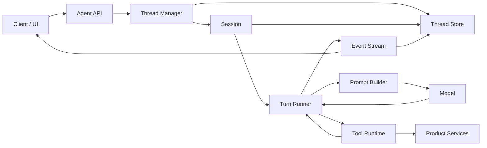
```mermaid
flowchart LR
    Client[Client / UI]
    API[Agent API]
    TM[Thread Manager]
    Store[Thread Store]
    S[Session]
    T[Turn Runner]
    PB[Prompt Builder]
    M[Model]
    TR[Tool Runtime]
    PS[Product Services]
    ES[Event Stream]

    Client --> API
    API --> TM
    TM --> Store
    TM --> S
    S --> T
    T --> PB
    PB --> M
    M --> T
    T --> TR
    TR --> PS
    TR --> T
    T --> ES
    S --> Store
    ES --> Client
    ES --> Store
```

一句话理解：

> thread 提供可恢复容器，session 提供运行态，turn 执行一次用户目标，prompt builder 生成模型输入，model 产出下一步意图，tool runtime 受控执行外部能力，event stream 把过程展示和记录下来。

## 2. Thread

### 2.1 Thread 状态机

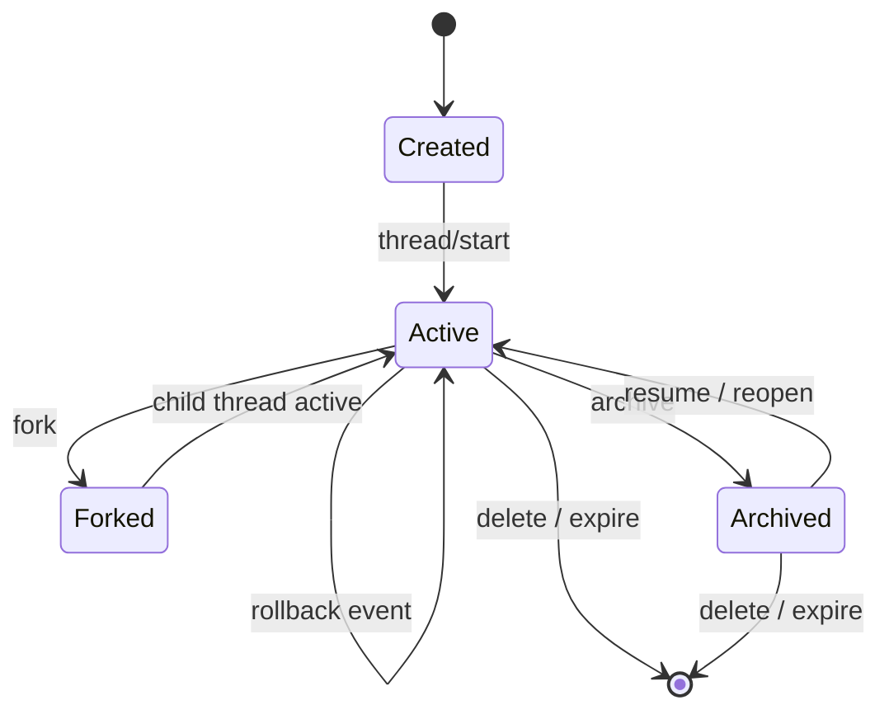
```mermaid
stateDiagram-v2
    [*] --> Created
    Created --> Active: thread/start
    Active --> Active: turn/start
    Active --> Active: append rollout line
    Active --> Active: compact
    Active --> Active: rollback event
    Active --> Forked: fork
    Forked --> Active: child thread active
    Active --> Archived: archive
    Archived --> Active: resume / reopen
    Active --> [*]: delete / expire
    Archived --> [*]: delete / expire
```

状态含义：

| 状态 | 含义 |
| --- | --- |
| `Created` | 已分配 thread id 和基础元数据，还未进入稳定运行。 |
| `Active` | 可接收新 turn，可 resume，可追加 rollout line。 |
| `Forked` | 基于某个历史点创建了子 thread；父 thread 可继续存在。 |
| `Archived` | 不再作为默认工作 thread，但仍可读取或恢复。 |

### 2.2 Thread 创建时序

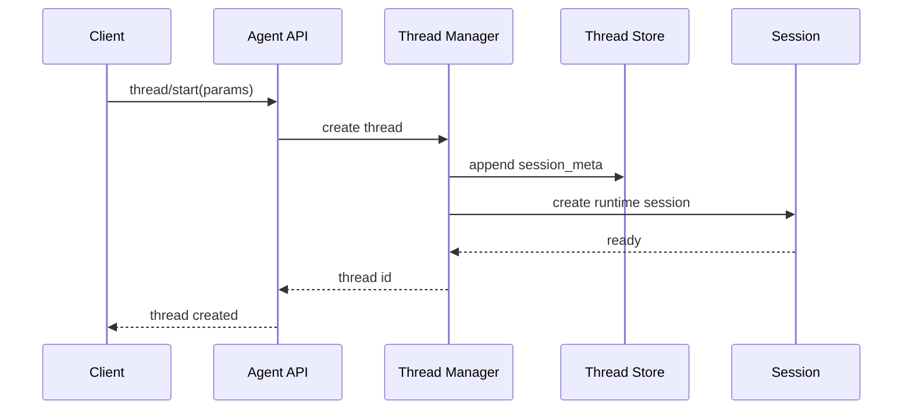
```mermaid
sequenceDiagram
    participant Client
    participant AgentAPI as Agent API
    participant TM as Thread Manager
    participant Store as Thread Store
    participant Session

    Client->>AgentAPI: thread/start(params)
    AgentAPI->>TM: create thread
    TM->>Store: append session_meta
    TM->>Session: create runtime session
    Session-->>TM: ready
    TM-->>AgentAPI: thread id
    AgentAPI-->>Client: thread created
```

业务逻辑：

1. 创建 thread id。
2. 写入 `session_meta` 或等价元数据。
3. 初始化 session runtime。
4. 返回给 UI 一个可继续发起 turn 的 thread。

### 2.3 Thread Resume 时序

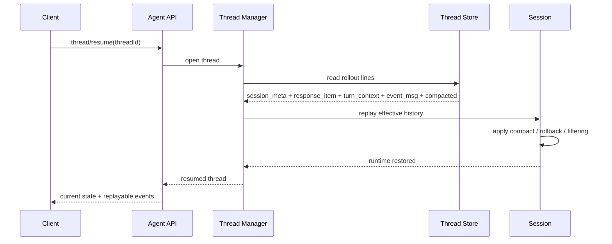
```mermaid
sequenceDiagram
    participant Client
    participant AgentAPI as Agent API
    participant TM as Thread Manager
    participant Store as Thread Store
    participant Session

    Client->>AgentAPI: thread/resume(threadId)
    AgentAPI->>TM: open thread
    TM->>Store: read rollout lines
    Store-->>TM: session_meta + response_item + turn_context + event_msg + compacted
    TM->>Session: replay effective history
    Session->>Session: apply compact / rollback / filtering
    Session-->>TM: runtime restored
    TM-->>AgentAPI: resumed thread
    AgentAPI-->>Client: current state + replayable events
```

关键点：

- resume 不是把 JSONL 原样发给模型。
- resume 的目标是重建 session 的有效运行态。
- 下一次 turn 采样前还会再加工 prompt history。

### 2.4 Thread 业务流程图

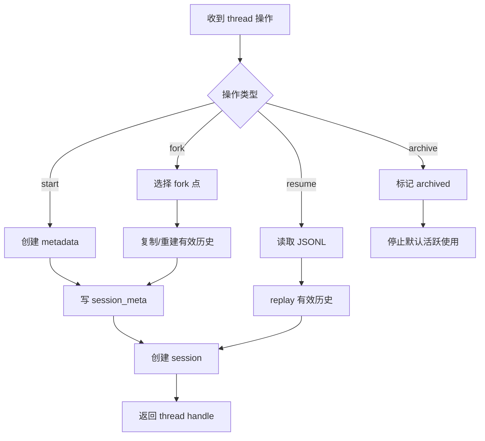
```mermaid
flowchart TD
    A[收到 thread 操作] --> B{操作类型}
    B -->|start| C[创建 metadata]
    C --> D[写 session_meta]
    D --> E[创建 session]
    B -->|resume| F[读取 JSONL]
    F --> G[replay 有效历史]
    G --> E
    B -->|fork| H[选择 fork 点]
    H --> I[复制/重建有效历史]
    I --> D
    B -->|archive| J[标记 archived]
    J --> K[停止默认活跃使用]
    E --> L[返回 thread handle]
```

## 3. Session

### 3.1 Session 状态机

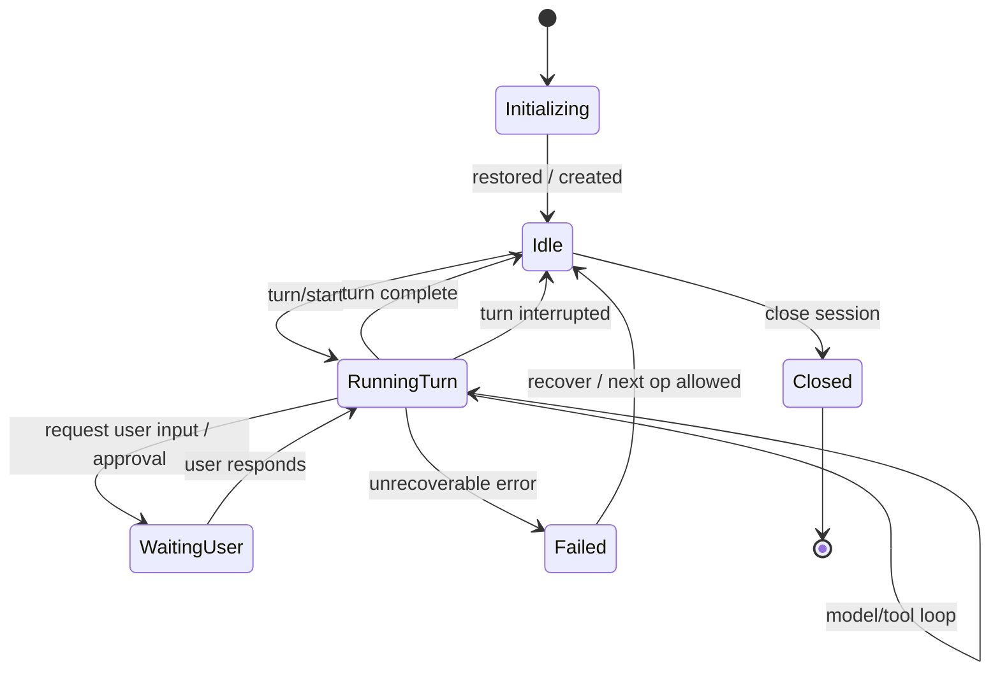
```mermaid
stateDiagram-v2
    [*] --> Initializing
    Initializing --> Idle: restored / created
    Idle --> RunningTurn: turn/start
    RunningTurn --> RunningTurn: model/tool loop
    RunningTurn --> WaitingUser: request user input / approval
    WaitingUser --> RunningTurn: user responds
    RunningTurn --> Idle: turn complete
    RunningTurn --> Idle: turn interrupted
    RunningTurn --> Failed: unrecoverable error
    Failed --> Idle: recover / next op allowed
    Idle --> Closed: close session
    Closed --> [*]
```

状态含义：

| 状态 | 含义 |
| --- | --- |
| `Initializing` | 从 thread metadata 和 rollout 恢复运行态。 |
| `Idle` | 当前没有 active turn，可接收新用户 turn。 |
| `RunningTurn` | 有一个 turn 正在采样、执行工具或处理事件。 |
| `WaitingUser` | 当前 turn 等待用户审批、确认或补充输入。 |
| `Failed` | 运行中出现错误，但 thread 不一定损坏。 |
| `Closed` | session runtime 结束；thread 仍可持久化存在。 |

### 3.2 Session 与 Thread 数据交互时序

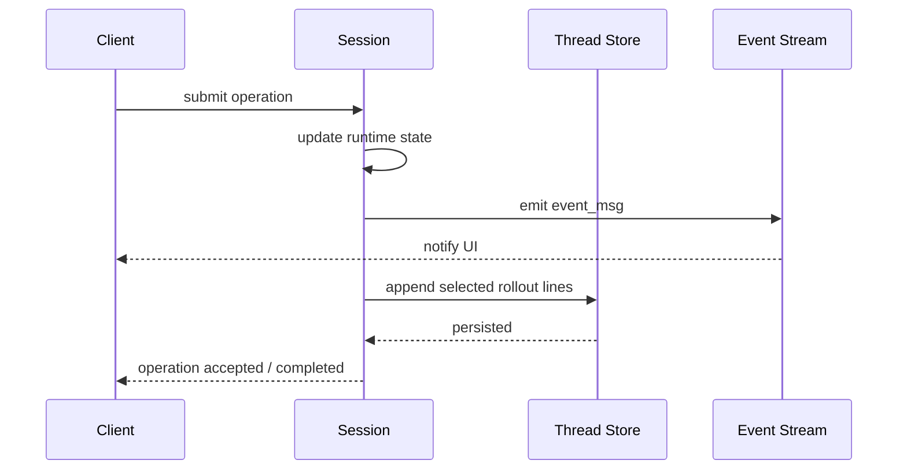
```mermaid
sequenceDiagram
    participant Client
    participant Session
    participant ThreadStore as Thread Store
    participant EventStream as Event Stream

    Client->>Session: submit operation
    Session->>Session: update runtime state
    Session->>EventStream: emit event_msg
    EventStream-->>Client: notify UI
    Session->>ThreadStore: append selected rollout lines
    ThreadStore-->>Session: persisted
    Session-->>Client: operation accepted / completed
```

注意：

- session 是生产者，thread store 是持久化结果。
- event stream 和 thread store 都消费 session 产生的数据，但用途不同。
- UI 看到的 event 不等于模型下一次会看到的 history。

### 3.3 Active Turn 管理流程

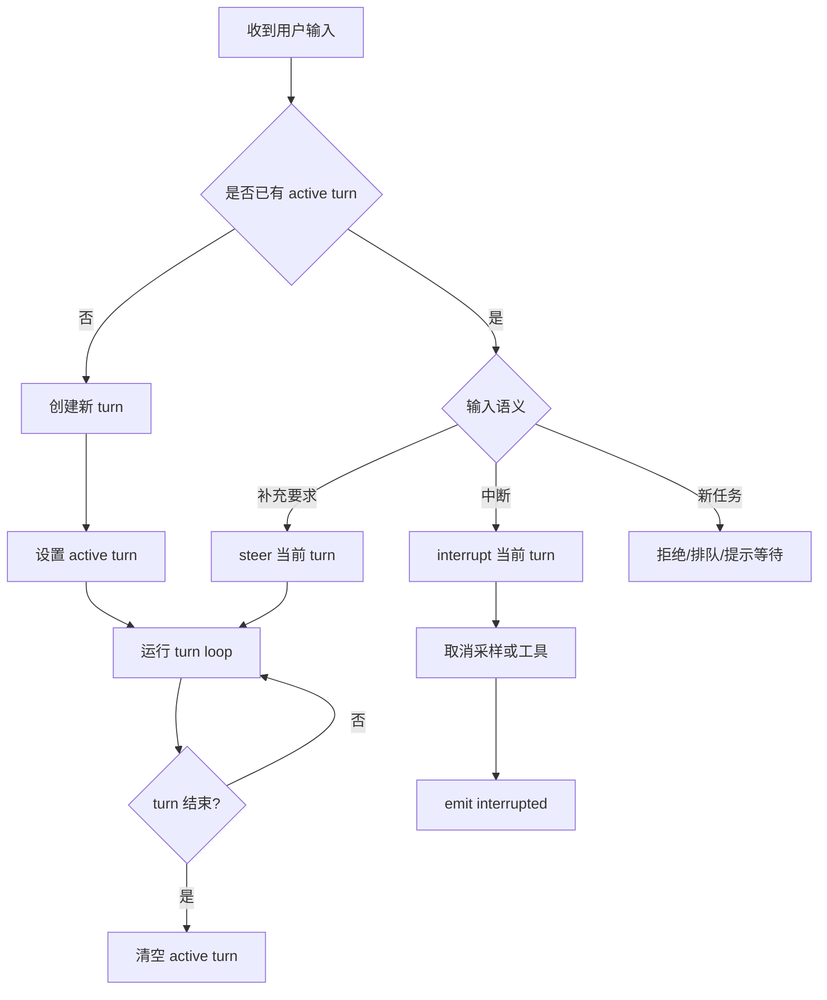
```mermaid
flowchart TD
    A[收到用户输入] --> B{是否已有 active turn}
    B -->|否| C[创建新 turn]
    C --> D[设置 active turn]
    D --> E[运行 turn loop]
    B -->|是| F{输入语义}
    F -->|补充要求| G[steer 当前 turn]
    F -->|中断| H[interrupt 当前 turn]
    F -->|新任务| I[拒绝/排队/提示等待]
    G --> E
    H --> J[取消采样或工具]
    J --> K[emit interrupted]
    E --> L{turn 结束?}
    L -->|是| M[清空 active turn]
    L -->|否| E
```

Web Word 映射：

- 同一个文档会话可以有一个 active editing turn。
- 用户在 agent 正在改写时追加“更正式一点”，应归为 steer，而不是新 thread。
- 用户点击停止，应中断 active turn，保留已生成的可审计事件。

## 4. Turn

### 4.1 Turn 状态机

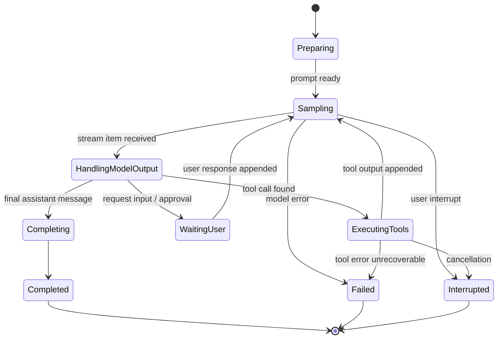
```mermaid
stateDiagram-v2
    [*] --> Preparing
    Preparing --> Sampling: prompt ready
    Sampling --> HandlingModelOutput: stream item received
    HandlingModelOutput --> ExecutingTools: tool call found
    ExecutingTools --> Sampling: tool output appended
    HandlingModelOutput --> WaitingUser: request input / approval
    WaitingUser --> Sampling: user response appended
    HandlingModelOutput --> Completing: final assistant message
    Completing --> Completed
    Sampling --> Failed: model error
    ExecutingTools --> Failed: tool error unrecoverable
    Sampling --> Interrupted: user interrupt
    ExecutingTools --> Interrupted: cancellation
    Completed --> [*]
    Failed --> [*]
    Interrupted --> [*]
```

状态含义：

| 状态 | 含义 |
| --- | --- |
| `Preparing` | 计算 turn context、当前用户输入、历史和工具。 |
| `Sampling` | 正在请求模型或接收模型 stream。 |
| `HandlingModelOutput` | 把模型输出转成 message、reasoning、tool call、plan 等 item。 |
| `ExecutingTools` | 执行模型请求的工具，并准备 tool output。 |
| `WaitingUser` | 等待用户确认、审批或补充输入。 |
| `Completing` | 收尾，写 usage、turn complete、清理 active turn。 |
| `Completed` | 正常结束。 |
| `Failed` | 失败结束。 |
| `Interrupted` | 被用户或系统取消。 |

### 4.2 Regular Turn 时序

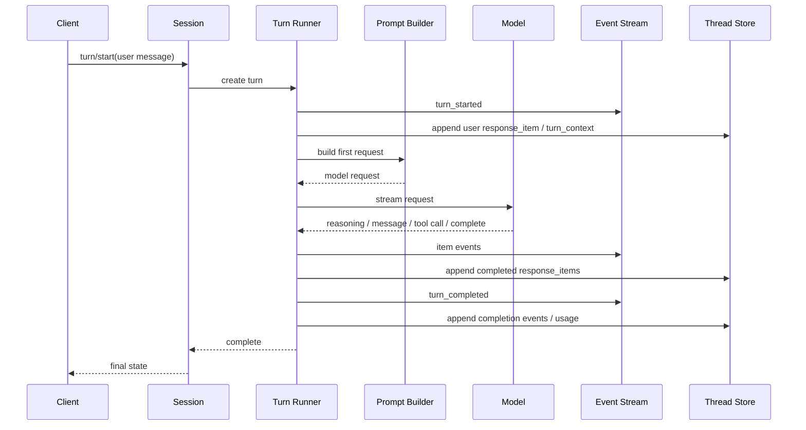
```mermaid
sequenceDiagram
    participant Client
    participant Session
    participant Turn as Turn Runner
    participant Prompt as Prompt Builder
    participant Model
    participant Events as Event Stream
    participant Store as Thread Store

    Client->>Session: turn/start(user message)
    Session->>Turn: create turn
    Turn->>Events: turn_started
    Turn->>Store: append user response_item / turn_context
    Turn->>Prompt: build first request
    Prompt-->>Turn: model request
    Turn->>Model: stream request
    Model-->>Turn: reasoning / message / tool call / complete
    Turn->>Events: item events
    Turn->>Store: append completed response_items
    Turn->>Events: turn_completed
    Turn->>Store: append completion events / usage
    Turn-->>Session: complete
    Session-->>Client: final state
```

### 4.3 Tool Follow-up Turn 时序

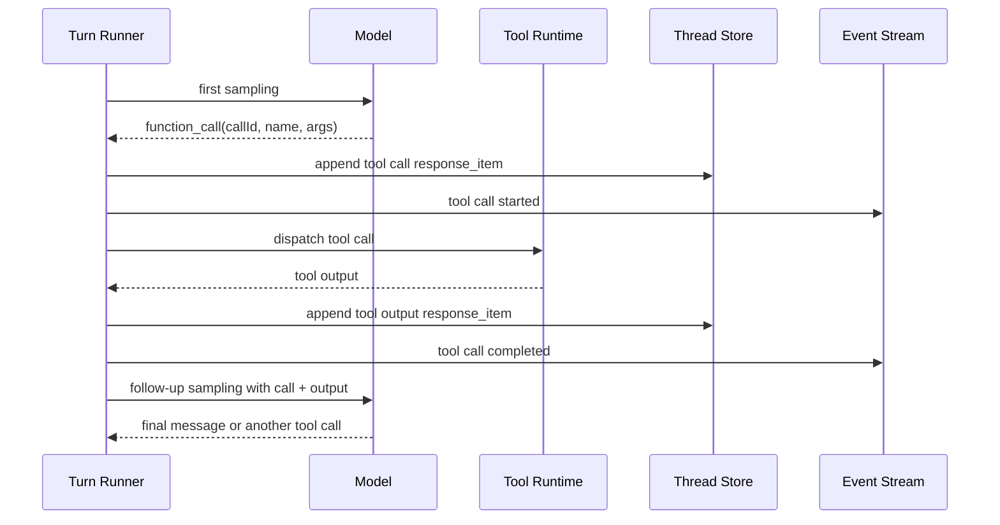
```mermaid
sequenceDiagram
    participant Turn as Turn Runner
    participant Model
    participant ToolRuntime as Tool Runtime
    participant Store as Thread Store
    participant Events as Event Stream

    Turn->>Model: first sampling
    Model-->>Turn: function_call(callId, name, args)
    Turn->>Store: append tool call response_item
    Turn->>Events: tool call started
    Turn->>ToolRuntime: dispatch tool call
    ToolRuntime-->>Turn: tool output
    Turn->>Store: append tool output response_item
    Turn->>Events: tool call completed
    Turn->>Model: follow-up sampling with call + output
    Model-->>Turn: final message or another tool call
```

关键点：

- 模型只表达“要调用什么工具”。
- agent 先记录工具调用，再执行工具。
- 工具结果进入后续采样，模型才基于结果继续回答。

### 4.4 Turn 完成流程图

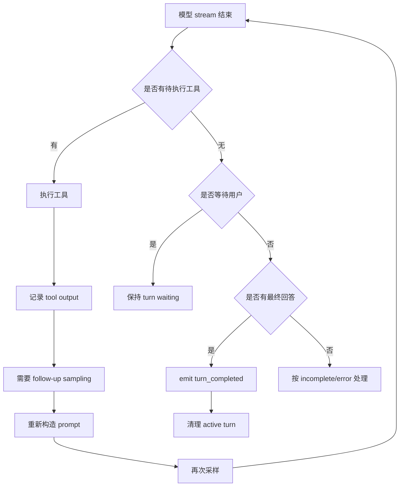
```mermaid
flowchart TD
    A[模型 stream 结束] --> B{是否有待执行工具}
    B -->|有| C[执行工具]
    C --> D[记录 tool output]
    D --> E[需要 follow-up sampling]
    E --> F[重新构造 prompt]
    F --> G[再次采样]
    G --> A
    B -->|无| H{是否等待用户}
    H -->|是| I[保持 turn waiting]
    H -->|否| J{是否有最终回答}
    J -->|是| K[emit turn_completed]
    J -->|否| L[按 incomplete/error 处理]
    K --> M[清理 active turn]
```

## 5. Prompt / Sampling

### 5.1 Prompt 构造流程图

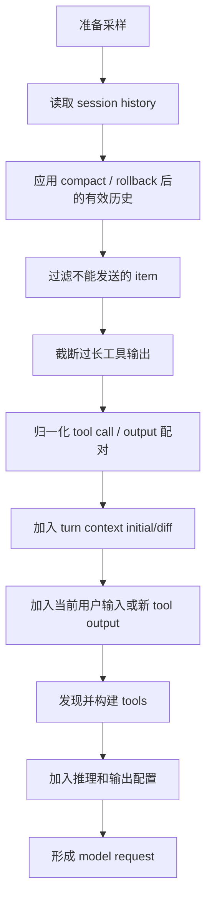
```mermaid
flowchart TD
    A[准备采样] --> B[读取 session history]
    B --> C[应用 compact / rollback 后的有效历史]
    C --> D[过滤不能发送的 item]
    D --> E[截断过长工具输出]
    E --> F[归一化 tool call / output 配对]
    F --> G[加入 turn context initial/diff]
    G --> H[加入当前用户输入或新 tool output]
    H --> I[发现并构建 tools]
    I --> J[加入推理和输出配置]
    J --> K[形成 model request]
```

核心结论：

> prompt 是每次采样前临时组装的请求，不是 thread JSONL 的原样投影。

### 5.2 首次采样时序

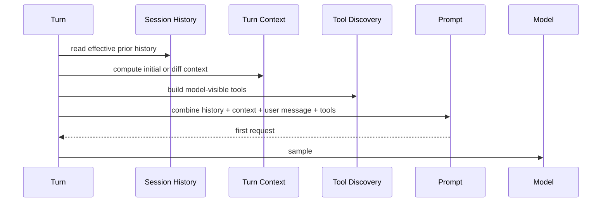
```mermaid
sequenceDiagram
    participant Turn
    participant History as Session History
    participant Context as Turn Context
    participant Tools as Tool Discovery
    participant Prompt
    participant Model

    Turn->>History: read effective prior history
    Turn->>Context: compute initial or diff context
    Turn->>Tools: build model-visible tools
    Turn->>Prompt: combine history + context + user message + tools
    Prompt-->>Turn: first request
    Turn->>Model: sample
```

### 5.3 后续采样时序

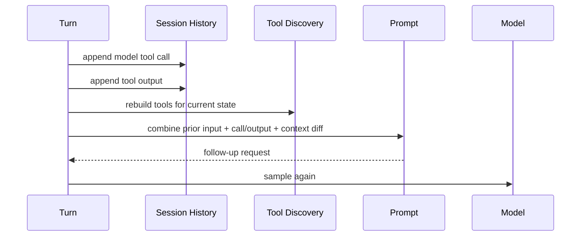
```mermaid
sequenceDiagram
    participant Turn
    participant History as Session History
    participant Tools as Tool Discovery
    participant Prompt
    participant Model

    Turn->>History: append model tool call
    Turn->>History: append tool output
    Turn->>Tools: rebuild tools for current state
    Turn->>Prompt: combine prior input + call/output + context diff
    Prompt-->>Turn: follow-up request
    Turn->>Model: sample again
```

首次和后续差异：

| 采样类型 | 新增关键内容 | 目的 |
| --- | --- | --- |
| 首次采样 | 当前用户输入、turn context、初始工具集合 | 让模型理解任务和可用能力 |
| 后续采样 | 模型 tool call、tool output、可能的 context diff | 让模型基于执行结果继续推理 |

## 6. Tool

### 6.1 Tool 发现状态机

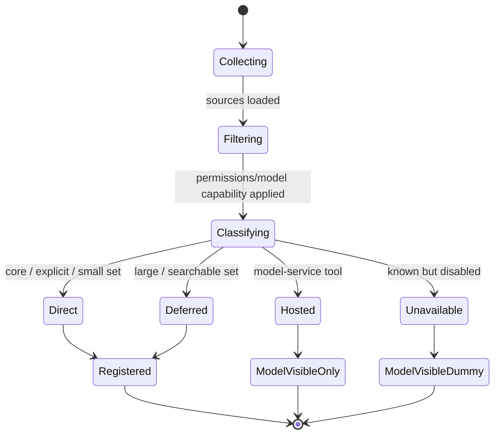
```mermaid
stateDiagram-v2
    [*] --> Collecting
    Collecting --> Filtering: sources loaded
    Filtering --> Classifying: permissions/model capability applied
    Classifying --> Direct: core / explicit / small set
    Classifying --> Deferred: large / searchable set
    Classifying --> Hosted: model-service tool
    Classifying --> Unavailable: known but disabled
    Direct --> Registered
    Deferred --> Registered
    Hosted --> ModelVisibleOnly
    Unavailable --> ModelVisibleDummy
    Registered --> [*]
    ModelVisibleOnly --> [*]
    ModelVisibleDummy --> [*]
```

工具来源：

- 内置工具。
- 环境工具。
- MCP / connector 工具。
- plugin 工具。
- skill 相关指令或能力。
- dynamic tools。
- hosted tools。
- unavailable dummy tools。

### 6.2 ToolRouter 构建流程

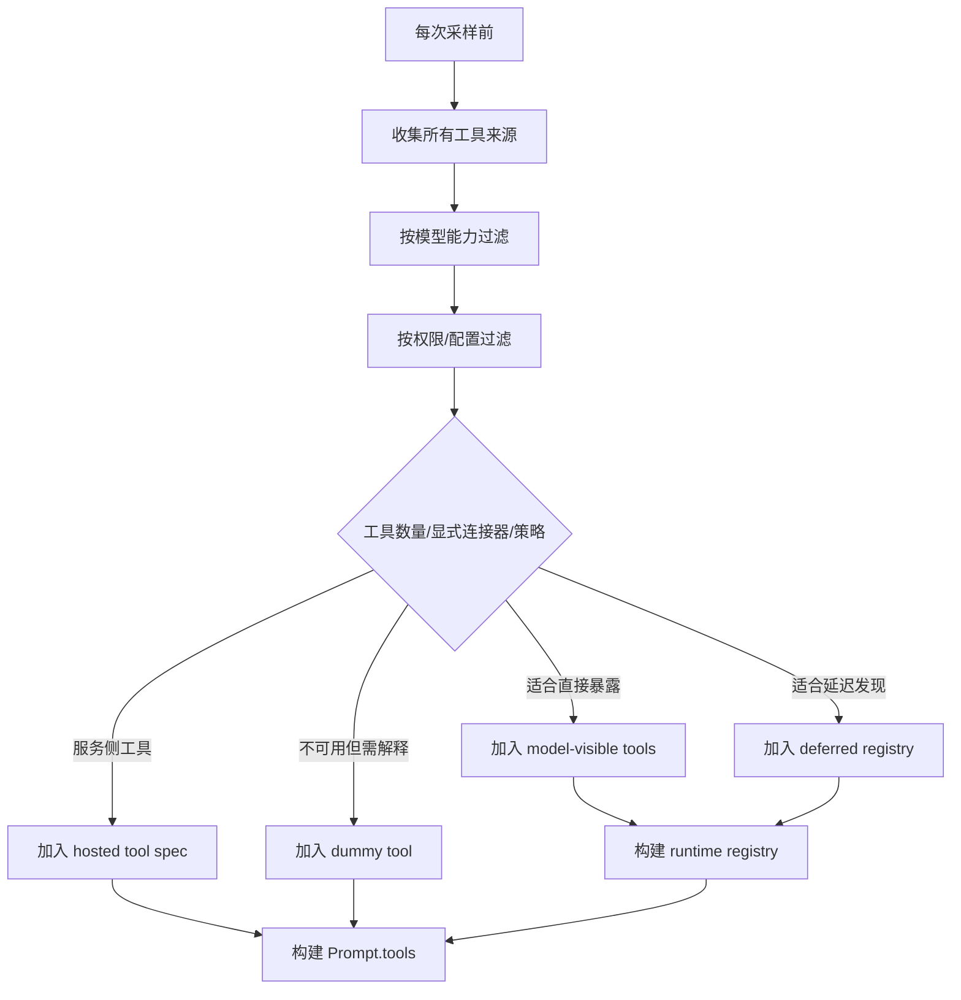
```mermaid
flowchart TD
    A[每次采样前] --> B[收集所有工具来源]
    B --> C[按模型能力过滤]
    C --> D[按权限/配置过滤]
    D --> E{工具数量/显式连接器/策略}
    E -->|适合直接暴露| F[加入 model-visible tools]
    E -->|适合延迟发现| G[加入 deferred registry]
    E -->|服务侧工具| H[加入 hosted tool spec]
    E -->|不可用但需解释| I[加入 dummy tool]
    F --> J[构建 runtime registry]
    G --> J
    H --> K[构建 Prompt.tools]
    I --> K
    J --> K
```

### 6.3 Tool 调用时序

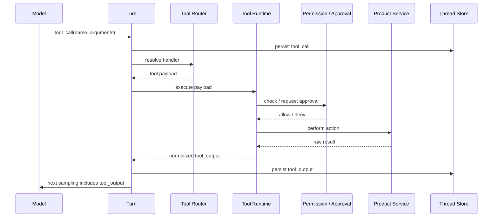
```mermaid
sequenceDiagram
    participant Model
    participant Turn
    participant Router as Tool Router
    participant Runtime as Tool Runtime
    participant Permission as Permission / Approval
    participant Product as Product Service
    participant Store as Thread Store

    Model-->>Turn: tool_call(name, arguments)
    Turn->>Store: persist tool_call
    Turn->>Router: resolve handler
    Router-->>Turn: tool payload
    Turn->>Runtime: execute payload
    Runtime->>Permission: check / request approval
    Permission-->>Runtime: allow / deny
    Runtime->>Product: perform action
    Product-->>Runtime: raw result
    Runtime-->>Turn: normalized tool_output
    Turn->>Store: persist tool_output
    Turn->>Model: next sampling includes tool_output
```

### 6.4 Tool 执行业务流程图

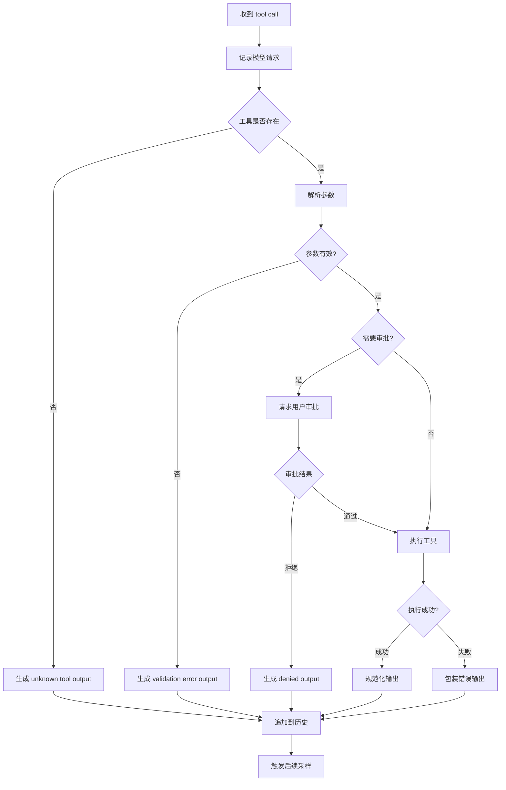
```mermaid
flowchart TD
    A[收到 tool call] --> B[记录模型请求]
    B --> C{工具是否存在}
    C -->|否| D[生成 unknown tool output]
    C -->|是| E[解析参数]
    E --> F{参数有效?}
    F -->|否| G[生成 validation error output]
    F -->|是| H{需要审批?}
    H -->|是| I[请求用户审批]
    I --> J{审批结果}
    J -->|拒绝| K[生成 denied output]
    J -->|通过| L[执行工具]
    H -->|否| L
    L --> M{执行成功?}
    M -->|成功| N[规范化输出]
    M -->|失败| O[包装错误输出]
    D --> P[追加到历史]
    G --> P
    K --> P
    N --> P
    O --> P
    P --> Q[触发后续采样]
```

## 7. History / Persistence

### 7.1 历史状态转换图

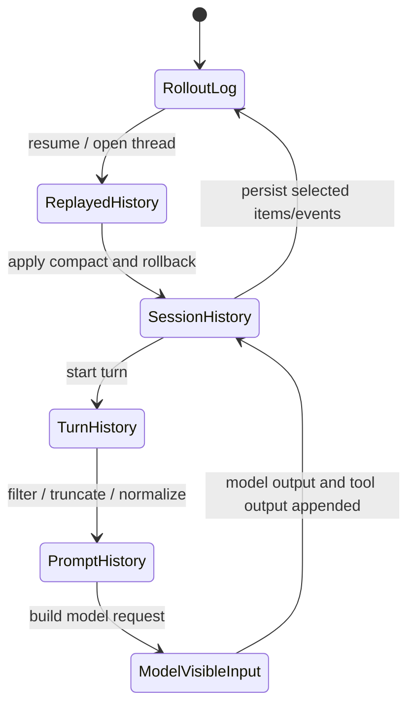
```mermaid
stateDiagram-v2
    [*] --> RolloutLog
    RolloutLog --> ReplayedHistory: resume / open thread
    ReplayedHistory --> SessionHistory: apply compact and rollback
    SessionHistory --> TurnHistory: start turn
    TurnHistory --> PromptHistory: filter / truncate / normalize
    PromptHistory --> ModelVisibleInput: build model request
    ModelVisibleInput --> SessionHistory: model output and tool output appended
    SessionHistory --> RolloutLog: persist selected items/events
```

### 7.2 Response Item 保存流程

```mermaid
flowchart TD
    A[产生模型相关 item] --> B{item 类型}
    B -->|user message| C[加入 session history]
    B -->|assistant message| C
    B -->|reasoning summary| C
    B -->|tool call| C
    B -->|tool output| D[截断/规范化后加入 history]
    B -->|system/internal only| E[不进入模型历史]
    C --> F[append response_item 到 JSONL]
    D --> F
    E --> G[可能只发 event 或丢弃]
```

### 7.3 Event Msg 保存流程

```mermaid
flowchart TD
    A[运行时产生 event_msg] --> B[发送给 Event Stream]
    B --> C[UI 实时消费]
    B --> D{持久化策略}
    D -->|limited 保留关键事件| E[append event_msg]
    D -->|extended 保留更多事件| E
    D -->|纯 delta / telemetry| F[不写核心 JSONL]
    E --> G{是否影响恢复}
    G -->|rollback/usage/关键状态| H[resume 时解释]
    G -->|普通 UI 事件| I[只用于 replay/display]
```

### 7.4 JSONL 恢复流程

```mermaid
flowchart TD
    A[读取 JSONL] --> B[找到 session_meta]
    B --> C[处理 compacted checkpoint]
    C --> D[收集 response_item]
    D --> E[解释 rollback event]
    E --> F[恢复 turn_context baseline]
    F --> G[生成 session history]
    G --> H[等待下一次 turn]
    H --> I[采样前再构造 prompt history]
```

## 8. Event / UI

### 8.1 Event 状态机

```mermaid
stateDiagram-v2
    [*] --> Created
    Created --> Emitted: sent to event stream
    Emitted --> Displayed: UI consumed
    Emitted --> Persisted: persistence filter accepted
    Emitted --> Dropped: transient event
    Persisted --> Replayed: resume / read thread
    Displayed --> [*]
    Dropped --> [*]
    Replayed --> [*]
```

### 8.2 Event 生产消费时序

```mermaid
sequenceDiagram
    participant Runtime as Agent Runtime
    participant EventStream as Event Stream
    participant UI
    participant Store as Thread Store
    participant Replay as Resume/Replayer

    Runtime->>EventStream: event_msg
    EventStream-->>UI: realtime notification
    EventStream->>Store: persist if policy allows
    Store-->>Replay: later read
    Replay-->>UI: replay selected events
```

### 8.3 UI 状态与模型历史分离流程

```mermaid
flowchart TD
    A[模型 stream delta] --> B[UI 显示增量]
    A --> C{item 是否完成}
    C -->|否| D[继续等待]
    C -->|是| E[形成 completed item]
    E --> F{是否模型可见}
    F -->|是| G[写 response_item / session history]
    F -->|否| H[只作为 event/UI 状态]
    G --> I[后续采样可见]
    H --> J[后续采样不可见]
```

## 9. Approval / User Input

### 9.1 Approval 状态机

```mermaid
stateDiagram-v2
    [*] --> NotNeeded
    NotNeeded --> Executing: safe action
    NotNeeded --> Requested: sensitive action
    Requested --> Approved: user approves
    Requested --> Denied: user denies
    Requested --> Cancelled: turn interrupted
    Approved --> Executing
    Denied --> ToolOutputDenied
    Cancelled --> ToolOutputCancelled
    Executing --> [*]
    ToolOutputDenied --> [*]
    ToolOutputCancelled --> [*]
```

### 9.2 Request User Input 时序

```mermaid
sequenceDiagram
    participant Model
    participant Turn
    participant Events as Event Stream
    participant UI
    participant History as Session History

    Model-->>Turn: request_user_input(...)
    Turn->>Events: input requested
    Events-->>UI: show choices / question
    UI-->>Turn: user response
    Turn->>History: append user response item
    Turn->>Model: follow-up sampling with response
```

业务含义：

- request user input 是 turn 暂停的一种形式。
- 用户响应后，响应本身要进入后续采样。
- 这不同于普通 UI 控件状态；它会影响模型继续推理。

## 10. Compact / Rollback / Fork

### 10.1 Compact 流程

```mermaid
flowchart TD
    A[历史过长] --> B[选择压缩范围]
    B --> C[生成 summary / replacement history]
    C --> D[写 compacted line]
    D --> E[替换 session history]
    E --> F[后续 prompt 使用压缩后历史]
```

### 10.2 Rollback 流程

```mermaid
flowchart TD
    A[用户请求 rollback] --> B[确定回滚 turn 数量或位置]
    B --> C[写 thread_rolled_back event]
    C --> D[session history 删除对应有效 turn]
    D --> E[UI 更新历史视图]
    E --> F[后续采样基于回滚后历史]
```

### 10.3 Fork 时序

```mermaid
sequenceDiagram
    participant Client
    participant TM as Thread Manager
    participant Store as Thread Store
    participant Parent as Parent Thread
    participant Child as Child Thread

    Client->>TM: fork(parentThreadId, point)
    TM->>Store: read parent rollout
    Store-->>TM: parent history
    TM->>TM: compute effective history at point
    TM->>Child: create child thread
    Child->>Store: write child session_meta + history baseline
    TM-->>Client: child thread id
```

## 11. Web Word 扁平映射

### 11.1 实体映射表

| Codex 抽象 | Web Word 抽象 | 说明 |
| --- | --- | --- |
| Thread | 文档协作会话 | 围绕一个文档或文档集合的可恢复 agent 会话。 |
| Session | 当前打开文档的 agent runtime | 管理内存历史、active turn、事件订阅。 |
| Turn | 一次写作/改写/审阅任务 | 用户的一次目标，不等于一条消息。 |
| TurnContext | 文档上下文快照 | 当前选区、文档版本、权限、语言、输出模式。 |
| ResponseItem | 模型可见交互 item | 用户请求、助手回答、工具调用、工具结果。 |
| EventMsg | UI/日志事件 | 工具进度、建议创建、审批请求、完成状态。 |
| Tool | 文档业务能力 | 读取选区、搜索文档、创建建议、添加批注、批量修改。 |
| Approval | 用户确认/企业权限 | 控制直接修改、外部发送、批量变更。 |

### 11.2 Web Word Turn 状态机

```mermaid
stateDiagram-v2
    [*] --> PreparingDocumentContext
    PreparingDocumentContext --> Sampling
    Sampling --> ReadingDocument: model requests read/search
    ReadingDocument --> Sampling: document context returned
    Sampling --> CreatingSuggestion: model requests suggestion/comment
    CreatingSuggestion --> Sampling: suggestion id returned
    Sampling --> WaitingApproval: direct edit / batch apply requested
    WaitingApproval --> ApplyingChange: approved
    WaitingApproval --> Sampling: denied result returned
    ApplyingChange --> Sampling: change result returned
    Sampling --> Completed: final response
    Sampling --> Interrupted
    Sampling --> Failed
    Completed --> [*]
    Interrupted --> [*]
    Failed --> [*]
```

### 11.3 Web Word 改写任务时序

```mermaid
sequenceDiagram
    participant UI as Web Word UI
    participant Runtime as Agent Runtime
    participant Prompt
    participant Model
    participant Tools as Document Tool Runtime
    participant Doc as Document Service
    participant Store as Thread Store

    UI->>Runtime: turn/start("改得更正式", selection)
    Runtime->>Prompt: build request with selection context
    Prompt-->>Runtime: model request
    Runtime->>Model: sample
    Model-->>Runtime: document.getSelection
    Runtime->>Tools: execute getSelection
    Tools->>Doc: read selected range
    Doc-->>Tools: text + range
    Tools-->>Runtime: tool output
    Runtime->>Store: persist call/output
    Runtime->>Model: follow-up sampling
    Model-->>Runtime: document.createSuggestion
    Runtime->>Tools: create suggestion
    Tools->>Doc: create suggestion on range
    Doc-->>Tools: suggestionId
    Tools-->>Runtime: tool output
    Runtime->>Model: follow-up sampling
    Model-->>Runtime: final message
    Runtime-->>UI: suggestion created + final answer
```

### 11.4 Web Word 业务流程图

```mermaid
flowchart TD
    A[用户在文档中发起 agent 请求] --> B[创建/定位 thread]
    B --> C[创建 turn]
    C --> D[收集文档上下文: 选区/版本/权限]
    D --> E[构造 prompt]
    E --> F[模型采样]
    F --> G{模型下一步}
    G -->|回答| H[展示回答]
    G -->|读取文档| I[执行只读工具]
    G -->|创建建议/批注| J[执行建议工具]
    G -->|直接修改| K[请求审批]
    I --> L[工具结果回灌]
    J --> L
    K --> M{用户审批}
    M -->|通过| N[执行修改工具]
    M -->|拒绝| O[生成拒绝结果]
    N --> L
    O --> L
    L --> F
    H --> P[turn complete]
    P --> Q[保存 item/event/文档引用]
```

## 12. 扁平化设计原则

如果自己实现 agent，可以用这组原则检查架构是否清楚：

1. 每个实体都有独立状态机，不让一个 `Conversation` 对象承载所有职责。
2. 每个行为都能画出时序图：谁发起、谁处理、谁持久化、谁通知 UI。
3. 每个业务流程都要说明哪些数据进入模型历史，哪些只是 UI 事件。
4. 工具调用一定分成“模型请求”和“runtime 执行”两段。
5. 持久化日志要能恢复运行态，但不要求原样作为 prompt。
6. Web Word 场景下，所有工具结果都应带文档定位信息。
7. 修改类能力优先生成 suggestion/comment；直接写正文必须有权限和审批边界。

