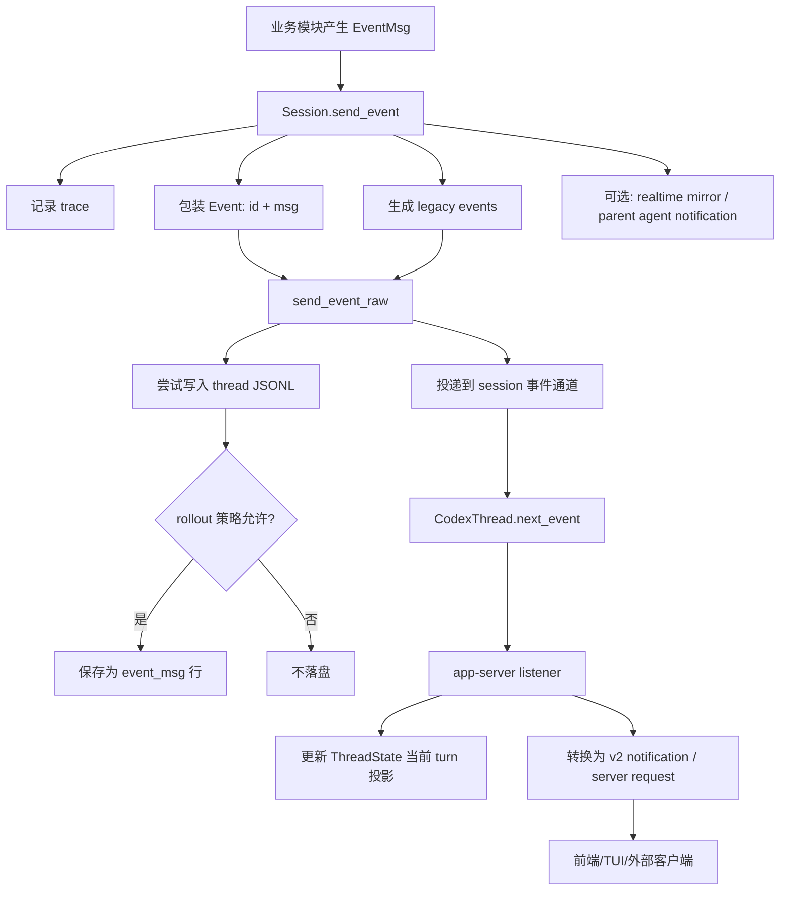
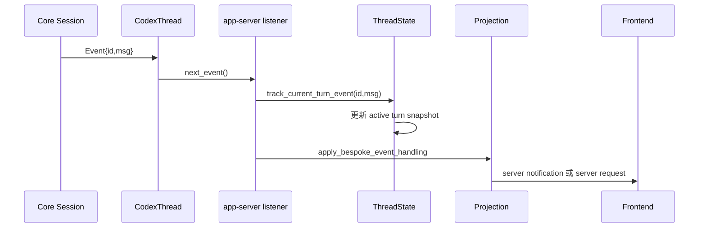
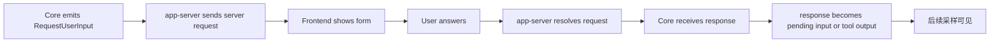

# EventMsg 的生产、消费链路与业务逻辑

这篇笔记专门解释 `event_msg`：

- 它什么时候产生？
- 经过哪些统一处理？
- 哪些会保存到 thread JSONL？
- 谁会消费它？
- 它和模型历史、UI item、turn segment、工具审批之间是什么关系？

核心结论：

1. `event_msg` 是 agent 运行时事件，不是模型 prompt 历史。
2. 它同时承担三类职责：实时通知、持久化回放、控制流信号。
3. 所有事件都会先尝试进入统一事件通道，但是否落盘由 rollout 持久化策略决定。
4. app-server 会把 core 的 `EventMsg` 投影成 v2 notifications/server requests；前端主要消费投影后的协议。
5. resume 构造模型历史时只使用少数 `event_msg` 的控制语义，例如 turn 边界、rollback、token count；不会把它们直接发给模型。

一个很重要的心智模型：

```ts
type MentalModel = {
  eventMsg: "偏日志属性和 UI 属性，可以表达正在发生、等待中、增量变化、生命周期边界";
  responseItem: "偏模型交互事实，是用户、agent、模型、工具之间已经稳定下来的协议层状态快照";
};
```

所以 `event_msg` 可以记录“开始了、正在流式输出、需要审批、工具运行中、turn 完成了”；`response_item` 记录的是“这件事已经稳定到可以放进后续模型历史里”。对模型流式输出而言，通常要等一个模型 output item 完整结束后，才会记录对应的 `response_item`。

## 1. EventMsg 是什么

`EventMsg` 是 agent 对外广播的运行事件。它被包在一个事件信封里：

```ts
type Event = {
  /**
   * 用于关联一次提交或一次 turn。
   * 很多场景下等于 turn_id，但不要把它理解为业务唯一主键；
   * 具体事件 payload 里也可能带自己的 turn_id / call_id / item_id。
   */
  id: string;
  msg: EventMsg;
};
```

抽象来看，`EventMsg` 覆盖这些类别：

```ts
type EventMsgCategory =
  | "turn_lifecycle"
  | "item_lifecycle"
  | "stream_delta"
  | "tool_lifecycle"
  | "approval_or_user_request"
  | "warning_error_guardian"
  | "context_and_token"
  | "review_or_rollback"
  | "multi_agent"
  | "realtime"
  | "background_system";
```

它和 `ResponseItem` 的边界：

```ts
type Boundary = {
  responseItem: "模型历史候选项，后续采样可能继续发给模型";
  eventMsg: "运行时事件，主要给 UI、回放、审计、控制流使用";
};
```

例如模型输出一句话时，系统可能同时产生：

- 一个 `ResponseItem.Message`：保存进模型历史，后续采样可见。
- 一个 `RawResponseItem` 事件：给调试/原始事件订阅者。
- 一个 `ItemCompleted` 事件：给 UI 表示一个 turn item 完成。
- 一个兼容旧协议的 `AgentMessage` 事件：给旧回放/旧 UI 使用。

这些不是同一个概念。

## 2. 总体链路



可以把它理解成：

```ts
function emitEvent(msg: EventMsg, turnContext: TurnContext): void {
  recordTrace(msg);

  const event: Event = {
    id: turnContext.turnId,
    msg,
  };

  sendEventRaw(event);

  maybeNotifyParentAgentIfTerminal(msg);
  maybeMirrorTextToRealtime(msg);
  maybeClearRealtimeHandoff(msg);

  for (const legacy of deriveLegacyEvents(msg)) {
    sendEventRaw({ id: turnContext.turnId, msg: legacy });
  }
}

function sendEventRaw(event: Event): void {
  tryAppendToRolloutJsonl({ type: "event_msg", payload: event.msg });
  recordProtocolTrace(event.msg);
  deliverToSubscribers(event);
}
```

实际实现里，`send_event` 会在发送原始事件之后，再派生 legacy events 并逐个发送。也就是说，新结构事件和兼容旧结构事件可能都会出现在实时事件流里，但落盘仍然要经过各自的持久化策略。

## 3. 生产者：谁会产生 EventMsg

### 3.1 Turn 生命周期

一次普通 turn 开始时产生：

```ts
type TurnStartedEvent = {
  turn_id: string;
  started_at?: number | null;
  model_context_window?: number | null;
  collaboration_mode_kind: "default" | "plan" | string;
};
```

turn 正常结束时产生：

```ts
type TurnCompleteEvent = {
  turn_id: string;
  last_agent_message?: string | null;
  completed_at?: number | null;
  duration_ms?: number | null;
  time_to_first_token_ms?: number | null;
};
```

turn 被中断或失败退出时产生：

```ts
type TurnAbortedEvent = {
  turn_id?: string | null;
  reason: "interrupted" | "replaced" | "shutdown" | string;
  completed_at?: number | null;
  duration_ms?: number | null;
};
```

业务含义：

- `TurnStarted` 打开一个运行中的 turn。
- `TurnComplete` 表示这个 turn 已经稳定结束。
- `TurnAborted` 表示这个 turn 不是正常完成，UI 和 server requests 要清理等待状态。

### 3.2 用户消息和 turn item 生命周期

当前用户输入会被保存成 `ResponseItem`，同时也会产生用户消息类事件。

```ts
type UserMessageEvent = {
  message: string;
  images?: string[];
  local_images: string[];
  text_elements: TextElement[];
};
```

UI 更推荐理解为通用 turn item 生命周期：

```ts
type ItemStartedEvent = {
  thread_id: string;
  turn_id: string;
  item: TurnItem;
  started_at_ms: number;
};

type ItemCompletedEvent = {
  thread_id: string;
  turn_id: string;
  item: TurnItem;
  completed_at_ms: number;
};
```

`TurnItem` 是 UI 视角的“可展示条目”，例如：

```ts
type TurnItem =
  | { type: "user_message"; content: UserInput[] }
  | { type: "agent_message"; content: AgentMessageContent[] }
  | { type: "reasoning"; summary: string[]; content: string[] }
  | { type: "plan"; text: string }
  | { type: "file_change"; changes: unknown; status?: string }
  | { type: "mcp_tool_call"; server: string; tool: string; result?: unknown }
  | { type: "web_search"; query?: string; action?: string }
  | { type: "image_generation"; status: string; result: unknown[] }
  | { type: "context_compaction"; summary: string };
```

业务含义：

- `ResponseItem` 是模型协议视角。
- `TurnItem` 是 UI/产品视角。
- `ItemStarted` / `ItemCompleted` 是 UI 渲染状态变化，不等于模型历史。

### 3.3 模型流式输出

模型 stream 中的增量会产生 delta 事件：

```ts
type AgentMessageContentDeltaEvent = {
  thread_id: string;
  turn_id: string;
  item_id: string;
  delta: string;
};

type ReasoningContentDeltaEvent = {
  thread_id: string;
  turn_id: string;
  item_id: string;
  delta: string;
  summary_index: number;
};

type PlanDeltaEvent = {
  thread_id: string;
  turn_id: string;
  item_id: string;
  delta: string;
};
```

业务含义：

- delta 用于“边生成边显示”。
- delta 通常不落盘。
- 等一个完整 item 完成后，才会产生稳定的 `ResponseItem` 和 `ItemCompleted`。

### 3.4 工具生命周期

工具执行会产生 begin/end 或 item started/completed 事件。

典型例子：

```ts
type ExecCommandBeginEvent = {
  call_id: string;
  process_id?: string | null;
  turn_id: string;
  started_at_ms: number;
  command: string[];
  cwd: string;
  source: string;
  interaction_input?: string | null;
};

type ExecCommandEndEvent = {
  call_id: string;
  process_id?: string | null;
  turn_id: string;
  completed_at_ms: number;
  command: string[];
  cwd: string;
  stdout: string;
  stderr: string;
  aggregated_output: string;
  exit_code?: number | null;
  duration: unknown;
  status: string;
};
```

patch、MCP、web search、image generation、多 agent 工具也有类似的事件。

业务含义：

- begin 让 UI 显示“工具正在运行”。
- output delta 让 UI 流式显示命令输出。
- end 让 UI 收敛为最终状态。
- 模型真正继续推理依赖的是工具输出 `ResponseItem`，不是这些 UI 事件。

### 3.5 审批、权限、请求用户输入

有些 `EventMsg` 会把 agent 暂停在一个等待外部响应的状态。

```ts
type BlockingRequestEvent =
  | { type: "exec_approval_request"; call_id: string; command: string[] }
  | { type: "apply_patch_approval_request"; call_id: string; changes: unknown }
  | { type: "request_permissions"; call_id: string; permissions: unknown }
  | { type: "request_user_input"; call_id: string; questions: Question[] }
  | { type: "elicitation_request"; id: string; request: unknown };
```

业务含义：

- core 发出事件，表示“需要人或外部系统给结果”。
- app-server 把它转换成 server request。
- 前端响应后，app-server 把结果回灌给 core。
- 回灌结果如果要影响模型，会再转换成用户输入、工具输出或错误输出。

这些 request 事件本身通常不落盘，也不作为 prompt 历史。

### 3.6 系统、上下文、观测类事件

还有一类事件不代表模型内容，而代表系统状态：

```ts
type SystemEventExamples =
  | "token_count"
  | "context_compacted"
  | "thread_rolled_back"
  | "warning"
  | "error"
  | "model_reroute"
  | "model_verification"
  | "skills_update_available"
  | "session_configured"
  | "shutdown_complete";
```

其中：

- `TokenCount` 用于 token 使用量展示和 resume 后恢复 usage。
- `ContextCompacted` 用于告诉 UI 历史被压缩。
- `ThreadRolledBack` 会影响历史重建。
- `Warning/Error` 主要用于用户提示和失败状态。

## 4. 统一发送逻辑

### 4.1 `send_event`

面向 turn 内事件。它知道当前 `turn_context`，因此可以：

- 用 turn id 包装事件。
- 记录 turn 级 trace。
- 记录 tool call trace。
- 发给实时订阅者。
- 必要时通知父 agent。
- 必要时同步到 realtime conversation。
- 派生 legacy events。

抽象结构：

```ts
type SendEventEffects = {
  trace: "记录 turn/tool/protocol trace";
  eventBus: "投递到 session rx_event";
  persistence: "尝试保存为 rollout event_msg";
  compatibility: "派生 legacy EventMsg";
  parentAgent: "子 agent terminal event 可通知父 agent";
  realtime: "部分文本事件可镜像到 realtime handoff";
  agentStatus: "terminal event 会更新 agent_status";
};
```

### 4.2 `send_event_raw`

面向没有完整 turn context 的事件，或已经包装好的事件。

典型场景：

- session configured。
- shutdown complete。
- skills update available。
- 某些初始化/错误事件。

它只做三件事：

```ts
type SendEventRawEffects = {
  persistence: "尝试写入 JSONL，是否保存由 rollout 策略决定";
  protocolTrace: "记录协议事件 trace";
  delivery: "投递到 session 事件 channel";
};
```

### 4.3 legacy events

新 UI 使用 `ItemStarted` / `ItemCompleted` / delta 更自然，但旧 UI 或旧 rollout 可能依赖更细的旧事件。

所以系统会从一些新事件派生 legacy events：

| 新事件 | 可能派生的旧事件 |
| --- | --- |
| `ItemStarted(WebSearch)` | `WebSearchBegin` |
| `ItemCompleted(WebSearch)` | `WebSearchEnd` |
| `ItemStarted(ImageGeneration)` | `ImageGenerationBegin` |
| `ItemCompleted(ImageGeneration)` | `ImageGenerationEnd` |
| `ItemStarted(FileChange)` | `PatchApplyBegin` |
| `ItemCompleted(FileChange)` | `PatchApplyEnd` |
| `ItemStarted(McpToolCall)` | `McpToolCallBegin` |
| `ItemCompleted(McpToolCall)` | `McpToolCallEnd` |
| `ItemCompleted(AgentMessage)` | `AgentMessage` |
| `ItemCompleted(Reasoning)` | `AgentReasoning` / raw reasoning |
| `ItemCompleted(ContextCompaction)` | `ContextCompacted` |

业务含义：

- 同一件事可能在实时流里出现“新事件”和“旧事件”两种表达。
- 持久化策略会分别判断每个事件是否写入 JSONL。
- thread history builder 需要兼容两种来源。

## 5. 持久化逻辑

所有 `EventMsg` 发送时都会尝试写入 rollout，但不是所有都会保存。

```ts
type EventPersistenceMode = "limited" | "extended";

type PersistDecision = {
  input: EventMsg;
  mode: EventPersistenceMode;
  output: "persist" | "drop";
};
```

### 5.1 limited 模式保存什么

limited 模式保存能支撑回放、turn segment、关键审计和历史操作的事件：

```ts
type LimitedPersistedEvent =
  | "user_message"
  | "agent_message"
  | "agent_reasoning"
  | "agent_reasoning_raw_content"
  | "patch_apply_end"
  | "token_count"
  | "context_compacted"
  | "entered_review_mode"
  | "exited_review_mode"
  | "mcp_tool_call_end"
  | "thread_rolled_back"
  | "turn_aborted"
  | "turn_started"
  | "turn_complete"
  | "web_search_end"
  | "image_generation_end"
  | "item_completed_plan";
```

`item_completed_plan` 是特殊情况：plan 的 UI 结果不是完整模型历史的一部分，所以保存完成事件来支持 resume 后回放。

### 5.2 extended 模式额外保存什么

extended 模式保存更多审计事件：

```ts
type ExtendedOnlyPersistedEvent =
  | "error"
  | "guardian_assessment"
  | "exec_command_end"
  | "view_image_tool_call"
  | "collab_agent_spawn_end"
  | "collab_agent_interaction_end"
  | "collab_waiting_end"
  | "collab_close_end"
  | "collab_resume_end"
  | "dynamic_tool_call_request"
  | "dynamic_tool_call_response";
```

注意：extended 模式下，`exec_command_end` 会被清洗，只保留有界的聚合输出，避免 rollout 文件膨胀。

### 5.3 明确不落盘的事件

常见不落盘事件：

```ts
type DroppedEventExamples =
  | "raw_response_item"
  | "item_started"
  | "agent_message_content_delta"
  | "plan_delta"
  | "reasoning_content_delta"
  | "exec_command_begin"
  | "exec_command_output_delta"
  | "exec_approval_request"
  | "request_permissions"
  | "request_user_input"
  | "elicitation_request"
  | "hook_started"
  | "hook_completed"
  | "plan_update"
  | "turn_diff"
  | "warning"
  | "model_reroute";
```

设计理由：

- delta 可以从最终 item 或最终事件收敛，不需要长期保存。
- approval/request 类事件是运行时控制点，不是历史事实的最终结果。
- begin 类事件如果落盘，resume 时容易留下“永远进行中”的 UI 状态。
- warning/model routing 等事件更多是当下提示，不参与历史重建。

## 6. 实时消费链路

app-server 的实时消费顺序可以抽象为：



关键点：

- app-server 先更新 `ThreadState`，再发 notification。
- `ThreadState` 用 `ThreadHistoryBuilder` 把事件增量投影成“当前 turn 快照”。
- 如果客户端没有打开 raw events，`RawResponseItem` 默认不会转发。
- 特定 `RawResponseItem` 仍可能被用来合成 hook prompt completion，避免 UI 漏掉 hook 继续提示。

### 6.1 转成 notification

大多数非阻塞事件会被转换成 server notification：

```ts
type ServerNotificationExamples =
  | "turn/started"
  | "turn/completed"
  | "turn/aborted"
  | "item/started"
  | "item/completed"
  | "raw_response_item/completed"
  | "token_count/updated"
  | "thread_goal/updated"
  | "mcp_server/status_updated"
  | "hook/started"
  | "hook/completed"
  | "turn_diff/updated"
  | "plan/updated";
```

### 6.2 转成 server request

阻塞型事件会被转换成请求，让前端必须回复：

```ts
type ServerRequestExamples =
  | "exec approval"
  | "apply patch approval"
  | "request permissions"
  | "request user input"
  | "mcp elicitation"
  | "dynamic tool call";
```

前端回复后，app-server 会调用对应的 core 接口，把决定或输入送回正在运行的 turn。



## 7. 持久化重放消费链路

thread/read、turns/list、resume picker 这类功能不会订阅实时 channel，而是读取 JSONL 后重放。

```mermaid
flowchart TD
    A[读取 JSONL RolloutItems] --> B[ThreadHistoryBuilder]
    B --> C{item 类型}
    C -->|event_msg| D[handle_event]
    C -->|response_item| E[只处理可映射到 UI 的特殊消息]
    C -->|compacted| F[插入压缩 UI item]
    C -->|turn_context/session_meta| G[忽略为 UI item]
    D --> H[构建 Turn
```

重放时 `event_msg` 的作用：

| 事件 | 重放用途 |
| --- | --- |
| `TurnStarted` | 显式打开一个 turn |
| `UserMessage` | 创建用户消息 item，并让 turn 算作真实用户 turn |
| `AgentMessage` | 创建助手消息 item |
| `AgentReasoning` | 创建或追加 reasoning item |
| `WebSearchEnd` / `ImageGenerationEnd` | 创建工具展示 item |
| `McpToolCallEnd` / `PatchApplyEnd` | 创建工具完成 item |
| `ItemCompleted(Plan)` | 恢复 plan item |
| `TurnComplete` | 关闭 turn，填充完成时间/耗时/最后消息 |
| `TurnAborted` | 标记 turn 中断 |
| `ThreadRolledBack` | 裁剪已构建的 turn |
| `TokenCount` | 不变成 UI item，但可用于 token usage replay |

这里的目标是构造 UI 的 `Turn[]`，不是构造模型 prompt。

## 8. resume 构造模型历史时如何使用 event_msg

resume 模型历史重建使用 `response_item` 作为主体，`event_msg` 只提供少量控制信息：

```ts
type ResumeUseOfEventMsg = {
  turn_started: "识别 turn segment 的开始边界";
  turn_complete: "识别 turn segment 的结束边界";
  turn_aborted: "识别未完成或被中断的 turn";
  user_message: "判断一个 segment 是否是真实用户 turn";
  thread_rolled_back: "裁剪最近 N 个用户 turn";
  token_count: "恢复 token usage 缓存";
  other: "通常不进入模型历史";
};
```

重要区别：

- `thread/read` 重放事件是为了 UI。
- `resume` 重建历史是为了下一次模型采样。
- 二者读取同一个 JSONL，但构造目标不同。

## 9. active turn 与 “thread 是否有 active turn”

app-server 内存里维护一个当前 turn 投影。

逻辑如下：

```ts
type ActiveTurnTracking = {
  onTurnStarted: "打开 current_turn";
  onUserMessage: "把用户消息追加到 current_turn";
  onItemStartedOrCompleted: "更新 current_turn.items";
  onTurnCompleteOrAborted: "如果 current_turn 已关闭，则清空 active turn";
};
```

所以“thread 是否有 active turn”不是只看 JSONL 文件最后一行，而是看运行中的 listener 是否已经把实时事件投影成当前 turn 状态。

持久化恢复时也能从 `TurnStarted` / `TurnComplete` / `TurnAborted` 重建历史 turn，但这不等于当前进程里一定还有 active turn。

## 10. EventMsg 与模型 prompt 的关系

`EventMsg` 一般不发给模型。

模型看到的是：

```ts
type ModelVisibleInput =
  | "user/developer/assistant message ResponseItem"
  | "reasoning ResponseItem"
  | "tool call ResponseItem"
  | "tool output ResponseItem"
  | "context/skill/plugin 注入 ResponseItem";
```

事件只是间接影响模型：

| EventMsg | 如何间接影响模型 |
| --- | --- |
| approval request | 用户批准/拒绝后，决定工具是否执行；结果再变成工具输出或错误输出 |
| request user input | 用户回答后，变成 pending input 或工具输出 |
| thread rolled back | 裁剪有效历史 |
| context compacted | 对应的 `compacted` / replacement history 影响后续历史 |
| token count | 影响展示和压缩判断，不作为 prompt item |
| plan update | 事件本身不进 prompt；工具调用和工具输出才进历史 |

## 11. 对 Web Word agent 的设计建议

如果你要实现 Web Word agent，建议把事件系统设计成“运行时事件总线”，而不是“聊天历史数组”。

```ts
type AgentRuntimeEvent = {
  eventId: string;
  threadId: string;
  turnId?: string;
  itemId?: string;
  callId?: string;
  type: string;
  payload: unknown;
  createdAt: number;
  persistence: "none" | "limited" | "extended";
  modelVisible: false;
};
```

建议拆成四层：

```ts
type WebWordAgentRuntime = {
  modelHistory: "只保存后续 prompt 需要的稳定模型历史";
  runtimeEvents: "保存/广播 UI、审批、流式、工具进度事件";
  turnProjection: "把事件投影成当前 turn 的 UI 状态";
  checkpoints: "保存压缩摘要和 replacement history";
};
```

具体建议：

- 流式文字、文档编辑进度、审批弹窗都走 `runtimeEvents`。
- 完整用户输入、助手输出、工具调用、工具结果走 `modelHistory`。
- 文档内容变化不要全部塞进 event；大段内容保存到文档版本系统，事件里只放版本号、范围、摘要、diff 引用。
- 每个工具调用必须有 `callId`，工具结束事件和工具输出历史都用它关联。
- active turn 不要靠“最后一条消息是不是完成”猜；要用 turn lifecycle event 投影。
- 持久化事件要分级：默认只保存可回放和可审计的关键事件，流式 delta 默认不保存。

## 12. 源码对照

| 主题 | 源码入口 |
| --- | --- |
| `Event` / `EventMsg` 定义 | `codex-rs/protocol/src/protocol.rs` |
| `TurnItem` 到 legacy events 的转换 | `codex-rs/protocol/src/items.rs` |
| session 统一发送事件 | `codex-rs/core/src/session/mod.rs` |
| turn started / complete / aborted | `codex-rs/core/src/tasks/regular.rs`, `codex-rs/core/src/tasks/mod.rs` |
| 模型 stream delta 和 item lifecycle | `codex-rs/core/src/session/turn.rs` |
| 工具 begin/end 和 turn diff | `codex-rs/core/src/tools/events.rs` |
| 审批、权限、用户输入请求 | `codex-rs/core/src/session/mod.rs` |
| rollout 事件持久化策略 | `codex-rs/rollout/src/policy.rs` |
| app-server 实时事件 listener | `codex-rs/app-server/src/request_processors/thread_lifecycle.rs` |
| app-server 事件投影/转换 | `codex-rs/app-server/src/bespoke_event_handling.rs` |
| 当前 turn 状态跟踪 | `codex-rs/app-server/src/thread_state.rs` |
| JSONL 重放构建 UI turns | `codex-rs/app-server-protocol/src/protocol/thread_history.rs` |
| resume 时事件如何影响模型历史 | `codex-rs/core/src/session/rollout_reconstruction.rs` |
