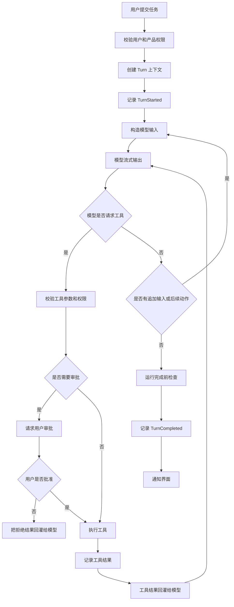
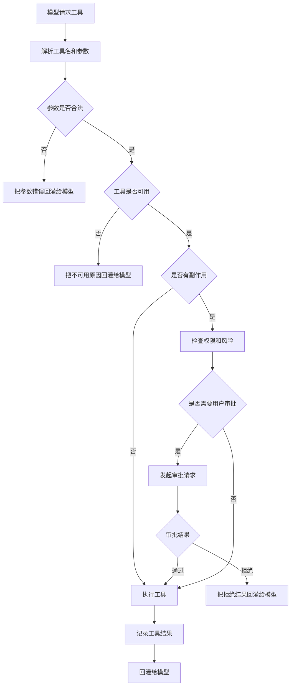
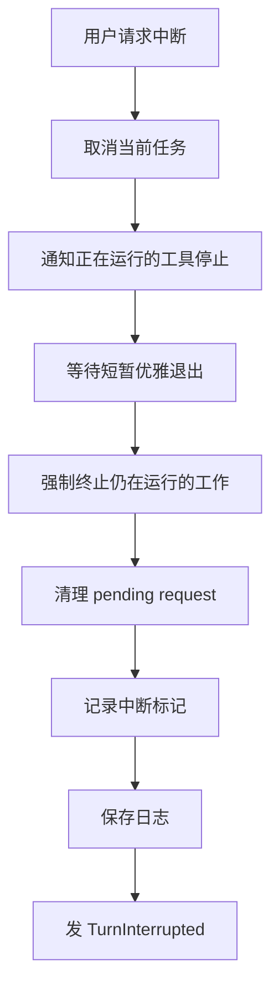
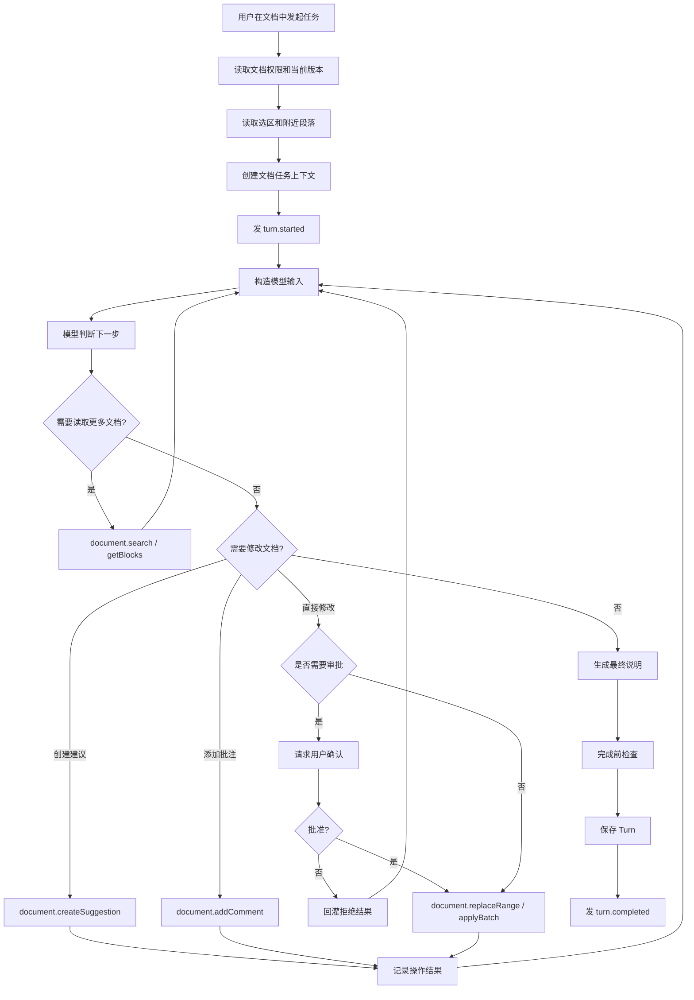

# Turn 领域业务逻辑深度学习

本文用通用 agent 设计语言解释 Turn。这里的 Turn 指“一次用户任务的完整执行过程”，不是一条聊天消息，也不是一次模型 API 调用。

对 Web Word 产品来说，一个 Turn 可以是：

- “把选中段落改得更正式。”
- “审阅这份合同并标注风险。”
- “总结第 3 章，并给出引用位置。”
- “把这份会议记录整理成行动项表格。”

Turn 的价值在于：把一次用户目标变成可执行、可观察、可中断、可审批、可审计、可恢复的一段业务流程。

## 1. 核心定义

一个 agent 系统通常有三层会话概念：

```text
Thread：长期会话线
  -> Session：当前运行态
      -> Turn：一次用户任务
          -> Item：任务过程里的一个事实
```

通用解释：

- Thread 解决“这件事如何长期继续”。
- Session 解决“当前运行时握有哪些资源和状态”。
- Turn 解决“这一次用户请求如何被处理完”。
- Item 解决“处理过程如何被展示、保存和恢复”。

Turn 的业务边界：

```text
用户输入
-> 创建本轮上下文
-> 调用模型
-> 执行工具
-> 回灌工具结果
-> 继续推理
-> 结束 / 中断 / 失败 / 等待用户
-> 保存过程并通知界面
```

## 2. Turn 不是消息

一条消息只表达“用户说了什么”。Turn 表达“系统为了完成这个请求做了什么”。

一个完整 Turn 通常包含：

- 用户输入。
- 本轮上下文快照。
- 模型输出。
- 推理摘要。
- 工具调用。
- 工具结果。
- 用户审批。
- 用户运行中追加输入。
- 生成的建议、批注、文件变化或业务操作。
- 错误、警告、中断。
- 最终回答。
- 成本、耗时、token 或调用统计。

所以，Turn 更像一个“任务执行单”，而不是聊天记录中的一行。

## 3. Turn 的通用状态

对外状态建议保持简单：

```text
InProgress：正在执行
Completed：正常完成
Interrupted：用户或系统中断
Failed：不可恢复失败
```

内部可以有更细的阶段，但不一定全部暴露给产品 API：

```text
Accepted
-> PreparingContext
-> RunningModel
-> RunningTool
-> WaitingApproval
-> WaitingUserInput
-> Continuing
-> Completing
-> Completed
```

异常路径：

```text
RunningModel / RunningTool / WaitingApproval
-> Interrupted

PreparingContext / RunningModel / RunningTool
-> Failed
```

设计建议：外部状态少而稳定，内部细节通过事件流表达。

## 4. Turn 的主流程

通用流程图：



这个流程体现了 agent 的核心循环：

```text
模型判断下一步
-> 系统执行真实动作
-> 结果返回给模型
-> 模型继续判断
```

## 5. Turn 上下文

Turn 上下文是“本轮任务的运行合同”。模型、工具、审批、安全策略都应该从这个上下文读取，而不是到处读全局状态。

一个通用 Turn 上下文应包含：

| 类别 | 内容 |
| --- | --- |
| 身份 | turn id、thread id、user id、tenant id |
| 产品对象 | document id、project id、workspace id 等 |
| 当前目标 | 用户原始输入、任务模式、输出要求 |
| 当前环境 | 当前文档版本、选区、光标、页面、工作目录 |
| 权限 | 用户权限、agent 能力权限、本轮审批策略 |
| 模型配置 | 模型、推理强度、输出 schema、流式配置 |
| 上下文材料 | 历史摘要、相关片段、业务规则、产品指令 |
| 可用工具 | 本轮允许调用哪些工具 |
| 观测信息 | trace id、开始时间、成本统计 |

Web Word 场景下，可以把它具体化成“文档任务上下文”：

```text
文档任务上下文
- 任务 id
- 会话线 id
- 用户 id / 租户 id
- 文档 id
- 文档版本
- 当前选区
- 选区附近段落
- 文档大纲
- 用户文档权限
- agent 编辑模式：只读 / 批注 / 建议 / 直接编辑
- 审批策略
- 检索策略
- 可用文档工具
- 输出格式
```

## 6. Turn 运行态

Turn 上下文偏“稳定配置”，Turn 运行态偏“执行过程中变化的东西”。

通用 Turn 运行态包括：

- 当前是否有运行中的任务。
- 等待中的工具调用。
- 等待中的用户审批。
- 等待中的用户补充输入。
- 等待中的外部系统响应。
- 已获得的临时权限。
- 已创建的建议、批注、变更记录。
- pending input。
- 本轮工具调用次数。
- 本轮开始时的成本基线。

Web Word 场景下，运行态可以包含：

- pending edit approval。
- pending style choice。
- pending connector authorization。
- created suggestion ids。
- created comment ids。
- affected ranges。
- version conflict records。
- pending user steer。

关键原则：等待外部响应的动作必须归属于当前 Turn，而不是散落在全局状态里。

## 7. Turn 启动

Turn 启动通常分两层：

```text
API 边界
-> 校验请求是否合法
-> 校验用户权限
-> 解析本轮配置
-> 生成 Turn id
-> 投递到 agent runtime

Runtime 边界
-> 创建 Turn 上下文
-> 合并 queued work
-> 建立取消令牌
-> 记录开始时间
-> 发 TurnStarted
-> 启动后台任务
```

API 边界应该尽早拒绝明显非法请求。例如：

- 用户没有文档读取权限。
- 用户没有直接编辑权限，却请求 direct edit。
- 文档版本过旧。
- 输入过大。
- 互斥配置同时出现。

Runtime 边界负责真正执行。它要保证一个 Session 不会同时跑多个互相冲突的主 Turn。

## 8. 模型输入构造

Turn 启动后，不应把所有信息一股脑塞给模型。推荐按层构造：

```text
系统规则
-> 产品规则
-> 用户目标
-> 当前对象上下文
-> 相关历史
-> 检索片段
-> 权限与审批说明
-> 可用工具说明
```

Web Word 示例：

```text
你是文档协作 agent
-> 默认使用建议模式，不直接改正文
-> 用户要“把选中段落改正式一点”
-> 当前选区文本
-> 选区前后段落
-> 文档标题路径
-> 用户有编辑权限，但大范围修改需确认
-> 可用工具：读取选区、创建建议、添加批注
```

关键原则：

- 当前选区比整篇文档更重要。
- 长文档应先给 outline，再按需检索片段。
- 修改前应重新读取目标范围，避免基于旧上下文写入。
- 权限和审批规则必须进入模型上下文，否则模型会提出不可执行方案。

## 9. 模型流式输出

模型输出可以拆成多个事件，而不是等最终答案一次返回。

通用流式事件：

```text
模型开始响应
-> 输出 item 开始
-> 文本 delta
-> 推理摘要 delta
-> 工具参数 delta
-> 输出 item 完成
-> 响应完成
```

UI 可以据此展示：

- agent 正在分析。
- agent 正在生成回答。
- agent 正在准备调用哪个工具。
- agent 正在等待工具结果。
- agent 已完成。

对 Web Word 来说，用户应该看到：

- 正在读取选区。
- 正在检索相关段落。
- 正在生成建议。
- 正在添加批注。
- 正在等待确认。

## 10. 工具调用闭环

模型不能直接修改真实世界。它只能请求工具。系统负责判断工具是否存在、是否允许、是否需要审批、如何执行。

通用工具流程：



工具调用有三个重要设计点：

1. 工具请求要记录下来，即使后续失败或被中断。
2. 工具失败很多时候不应直接让 Turn 失败，而是作为结果回灌给模型。
3. 有副作用的工具必须走权限和审批。

Web Word 工具建议：

- `document.getSelection`
- `document.search`
- `document.createSuggestion`
- `document.addComment`
- `document.replaceRange`
- `document.applyBatch`

默认策略：

- 读取类工具可以自动执行。
- 创建建议和批注通常可以自动执行。
- 直接替换正文需要更高权限。
- 批量修改、大范围删除、导出、发送给外部系统需要审批。

## 11. 工具结果回灌

工具执行完后，结果要变成模型可理解的输入。

通用工具结果应包含：

- 是否成功。
- 操作对象。
- 影响范围。
- 新生成的对象 id。
- 错误原因。
- 是否可重试。
- 是否需要用户介入。

Web Word 示例：

```text
工具：document.createSuggestion
结果：
- success: true
- suggestionId: sug_123
- affectedRange: paragraph_8:10-120
- documentVersion: 43
- preview: 已创建一条正式化改写建议
```

模型拿到这个结果后，才能继续告诉用户：“我已经在选中段落上创建了一条改写建议。”

## 12. Follow-up 循环

Turn 内部可能多次调用模型。

常见原因：

- 模型调用了工具，需要把工具结果发回模型。
- 用户运行中追加了输入。
- 工具参数错误，需要模型修正。
- 审批被拒绝，需要模型换方案。
- 上下文太长，需要压缩后继续。
- 完成前检查要求模型补充说明。

通用循环：

```text
构造模型输入
-> 模型输出
-> 工具或文本
-> 如果工具：执行并记录结果
-> 如果有后续输入：记录输入
-> 如果还需继续：重新构造模型输入
-> 否则完成
```

这就是 Turn 和“单次模型调用”的核心区别。

## 13. 运行中追加输入

用户可能在 agent 运行中补充要求：

- “等等，不要直接改正文，只加建议。”
- “只关注法律风险。”
- “把语气再轻一点。”

这类输入不应简单开启新 Turn，也不应强行打断当前 Turn。推荐设计：

```text
用户追加输入
-> 检查当前是否有 active turn
-> 检查 turn 是否允许追加
-> 检查 expected turn id 是否匹配
-> 放入 pending input
-> 主循环在安全点读取
```

安全点通常是：

- 一次模型响应结束后。
- 一次工具执行结束后。
- 下一轮模型输入构造前。

不建议在模型流式输出中间强行插入，这容易造成上下文顺序混乱。

## 14. 等待用户决策

Turn 里经常需要等待用户：

- 是否批准大范围修改。
- 选择哪种改写风格。
- 是否授权访问外部系统。
- 是否确认导出或发送文档。

通用模式：

```text
创建 pending request
-> 保存到 Turn 运行态
-> 发事件给 UI
-> UI 收集用户决定
-> 决定回到 runtime
-> 找到 pending request
-> 唤醒等待中的工具或流程
```

这比“工具内部直接弹窗等待”更稳，因为 pending request 是可追踪、可超时、可取消、可恢复的。

## 15. Turn 完成

Turn 完成不只是“模型说完了”。完成前通常要做：

- 确认没有未处理的工具结果。
- 确认没有 pending input。
- 运行完成前检查。
- 刷新持久化日志。
- 统计本轮成本和耗时。
- 记录最终消息。
- 发送完成事件。
- 清理 active turn。

通用完成流程：

```text
模型无后续动作
-> 没有 pending input
-> 没有等待中的工具或审批
-> 运行完成前检查
-> 保存最终状态
-> 发 TurnCompleted
-> Session 回到 idle
```

Web Word 的完成前检查可以包括：

- 是否创建了建议但没有告诉用户。
- 是否修改了锁定区域。
- 是否回答长文档问题却没有引用。
- 是否出现文档版本冲突未处理。

## 16. Turn 中断

中断不是删除历史，而是停止继续执行，并保留已经发生的事实。

通用中断流程：



关键规则：

- 已完成的工具结果不能假装没发生。
- 已创建的建议和批注要保留记录。
- 历史里要标记“此 Turn 被中断”，避免后续恢复时误以为任务完整完成。
- 中断后可以继续开启新的 Turn。

## 17. Turn 失败

失败和中断不同。

中断是用户或系统主动停止；失败是系统无法继续完成。

常见失败：

- 请求非法。
- 权限不足且无法降级。
- 模型请求不可恢复失败。
- 工具系统不可用。
- 文档版本冲突无法自动修复。
- 输出 schema 无法满足。

失败处理建议：

- 给出明确错误。
- 保存已发生过程。
- 不要把半完成结果包装成成功。
- 如果可恢复，告诉用户下一步可怎么做。

## 18. 事件流

Turn 应通过事件流让 UI 看见过程。

通用事件：

```text
turn.started
item.started
agent.message.delta
agent.reasoning.delta
tool.call.started
tool.call.updated
tool.call.completed
approval.requested
approval.resolved
document.suggestion.created
document.comment.created
turn.diff.updated
turn.completed
turn.interrupted
turn.failed
```

事件既是 UI 通知，也是审计事实。最好不要让 UI 自己猜 agent 状态。

## 19. 持久化

Turn 至少要保存：

- turn id。
- thread id。
- 用户输入。
- 上下文摘要。
- 事件序列。
- 工具调用和结果。
- 用户审批。
- 生成的建议、批注、变更 id。
- 最终回答。
- 状态。
- 错误。
- 耗时和成本。

持久化的目的：

- UI 重连后恢复进度。
- 用户以后能查看 agent 做过什么。
- 失败和中断可以审计。
- 后续 Turn 能理解之前发生过什么。
- 支持 rollback、fork、resume。

## 20. Web Word Turn 推荐流程



## 21. Web Word Turn 数据模型草案

### Turn

```text
Turn
- id
- thread_id
- document_id
- user_id
- status
- user_goal
- started_at
- completed_at
- final_message
- error
```

### 任务上下文

```text
任务上下文
- 任务 id
- 文档 id
- 文档版本
- 当前选区
- 大纲快照
- 权限配置
- 编辑模式
- 审批策略
- 可用工具
- 输出格式约束
```

### TurnItem

```text
TurnItem
- id
- turn_id
- type
- status
- payload
- created_at
- completed_at
```

常见 item type：

- user_message
- agent_message
- tool_call
- tool_result
- approval_request
- suggestion_created
- comment_created
- error

### ToolCall

```text
ToolCall
- id
- turn_id
- tool_name
- arguments
- status
- result
- affected_ranges
- document_version_before
- document_version_after
```

## 22. 设计原则

1. Turn 是一次任务执行，不是一条消息。
2. Turn 上下文是本轮事实来源。
3. 工具能力按本轮权限动态暴露。
4. 有副作用的工具默认需要权限检查。
5. 大风险动作进入审批流程。
6. 工具失败优先回灌模型，让模型尝试修正。
7. 用户追加输入进入 pending input，在安全点处理。
8. 中断要保留已发生事实。
9. 完成事件统一发出，不要散落在每个工具里。
10. UI 只消费事件，不自己推断状态。

## 23. MVP 边界

Web Word agent 第一版的 Turn 闭环建议只做：

```text
turn/start
-> 读取选区
-> 调模型
-> 创建建议
-> 工具结果回灌
-> 最终说明
-> turn/completed
```

最低工具集：

- `document.getSelection`
- `document.createSuggestion`
- `document.addComment`

最低事件集：

- `turn.started`
- `agent.message.delta`
- `tool.call.started`
- `tool.call.completed`
- `document.suggestion.created`
- `document.comment.created`
- `turn.completed`
- `turn.interrupted`
- `turn.failed`

暂缓：

- 多 agent。
- 插件市场。
- 任意外部连接器。
- 大范围自动改写。
- 复杂权限继承。
- 跨文档批处理。

## 24. 源码对照附录

以下只是 Codex 源码里的对照入口，用来验证通用设计从哪里抽象出来。日常学习时先看上面的通用模型，不必先读源码。

| 通用概念 | Codex 对照入口 |
| --- | --- |
| Turn API | `codex-rs/app-server-protocol/src/protocol/v2/turn.rs` |
| Turn 请求边界 | `codex-rs/app-server/src/request_processors/turn_processor.rs` |
| Turn op 分发 | `codex-rs/core/src/session/handlers.rs` |
| Turn 上下文 | `codex-rs/core/src/session/turn_context.rs` |
| Turn 主循环 | `codex-rs/core/src/session/turn.rs` |
| Turn 运行态 | `codex-rs/core/src/state/turn.rs` |
| Task 生命周期 | `codex-rs/core/src/tasks/mod.rs` |
| 普通 Turn task | `codex-rs/core/src/tasks/regular.rs` |
| 模型 item 分流 | `codex-rs/core/src/stream_events_utils.rs` |
