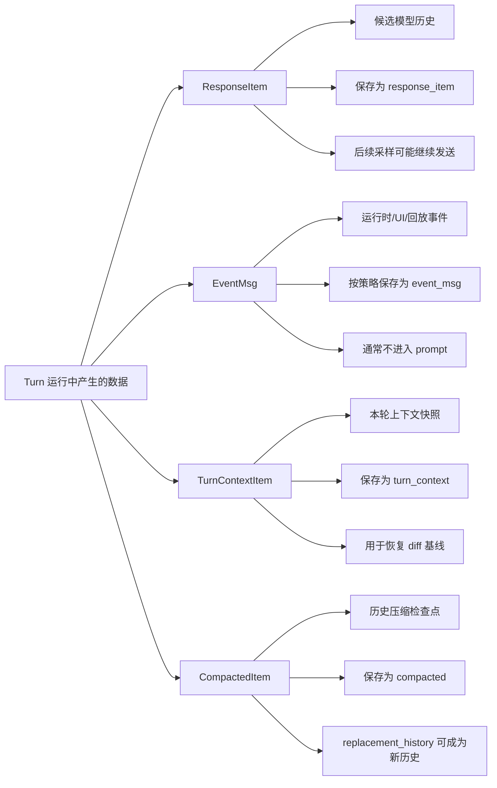
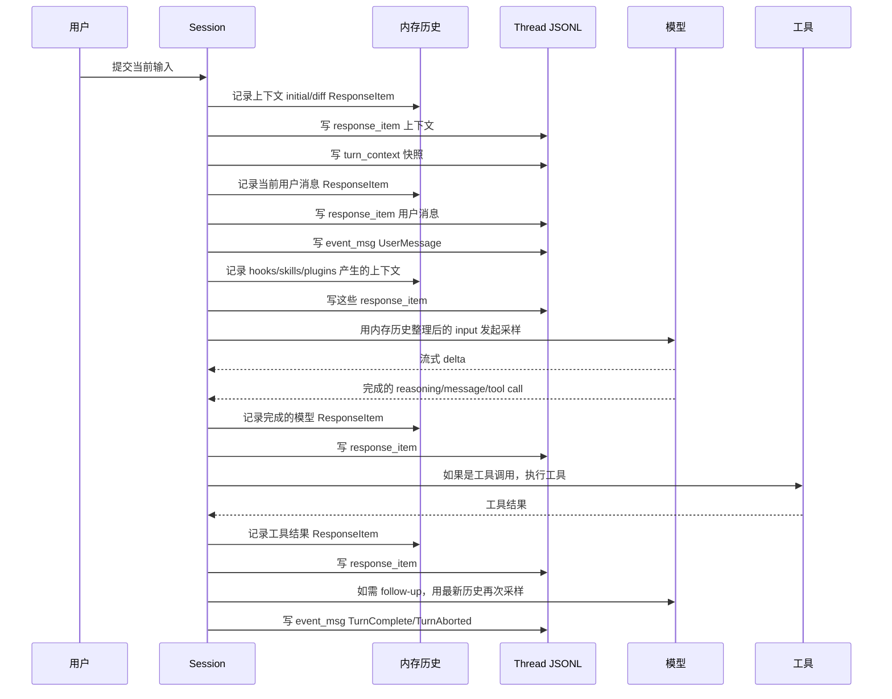
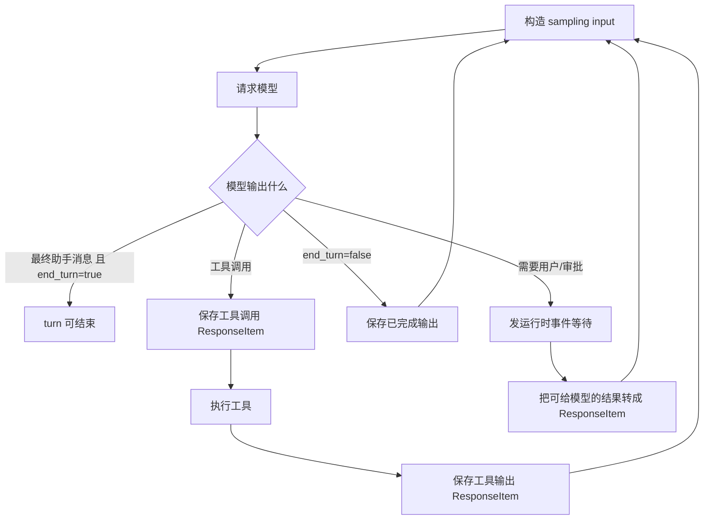
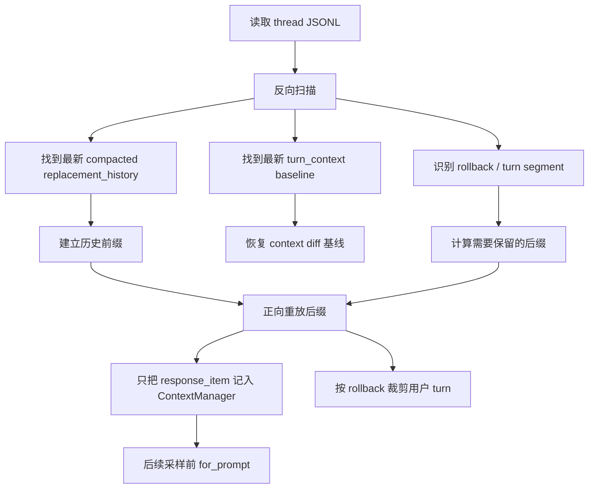

# Turn 过程 Item 的保存与后续采样

这篇笔记回答两个问题：

- Turn 运行过程中产生的 item 是怎样保存到 thread JSONL 的？
- 哪些 item 会进入后续采样，继续发给模型？

核心结论：

1. thread JSONL 不是“下一次 prompt 的原样副本”，而是一个可恢复的运行日志。
2. 真正会被后续采样使用的是从 JSONL 或内存重建出的“有效模型历史”。
3. UI 事件、流式 delta、审批弹窗、用户确认弹窗等，大多不是模型历史；它们即使被发给前端，也不会作为后续 prompt 的输入。
4. 工具调用必须保存成“模型请求工具”加“工具返回结果”这一对模型历史，否则模型无法在下一次采样中接着推理。

另一个关键心智模型：

```ts
type ItemPersistenceMentalModel = {
  eventMsg: "日志/UI/控制流事件，可以表达进行中状态";
  responseItem: "模型协议层的稳定事实快照，可以作为后续 prompt 历史";
};
```

因此，“`response_item` 是不是 item 要完结了才会落盘？”更准确的答案是：当某个模型可见事实已经稳定、可以放入后续模型历史时才会记录。对模型流式输出来说，通常是完整 output item 结束后；对用户消息、上下文注入、skill/plugin 注入来说，它们构造完成后会在采样前立即记录；对工具来说，完整 tool call 会先记录，工具执行完成后再记录 tool output。

## 1. 先区分四类 item

Turn 过程中会产生很多“东西”，但它们的用途不同。



### `ResponseItem`

这是最接近“模型看到的历史”的结构。它包括用户消息、开发者上下文、助手消息、推理、工具调用、工具结果等。

它有三个去向：

- 进入 session 内存里的历史。
- 保存到 thread JSONL 的 `response_item` 行。
- 在后续采样前被整理成模型请求的 `input`。

### `EventMsg`

这是运行时事件，主要服务 UI、回放、审计、thread segment 识别。

例如：

- turn started / complete / aborted。
- user message 事件。
- token count。
- plan item completed。
- web search end、image generation end。
- rollback。

它不等于模型历史。大多数 `EventMsg` 不会进入后续采样。

### `TurnContextItem`

这是“本轮运行环境和配置”的快照。

它保存：

- 当前工作目录、时间、时区。
- 模型、推理 effort、summary 设置。
- sandbox、approval、permission、network 策略。
- user instructions、developer instructions、personality。
- collaboration mode、realtime 状态等。

它本身不会直接发给模型。它的主要作用是：

- resume 时恢复“上一轮上下文基线”。
- 判断下一轮是否只需要注入 diff，还是需要重新注入完整上下文。

### `CompactedItem`

这是压缩检查点。

它保存：

- 压缩摘要。
- 可选的 `replacement_history`。

如果存在 `replacement_history`，resume 时会用它替换旧历史的前缀，然后只重放压缩点之后的 JSONL 后缀。

## 2. JSONL 顶层结构

每一行是一个 rollout line，大致结构如下：

```ts
type RolloutLine = {
  timestamp: string;
  item: RolloutItem;
};

type RolloutItem =
  | { type: "session_meta"; payload: SessionMetaLine }
  | { type: "response_item"; payload: ResponseItem }
  | { type: "event_msg"; payload: EventMsg }
  | { type: "turn_context"; payload: TurnContextItem }
  | { type: "compacted"; payload: CompactedItem };
```

不同类型的业务含义：

```ts
type RolloutItemMeaning = {
  session_meta: "thread/session 的元信息，通常在线程创建时写入";
  response_item: "模型历史候选项，是后续 prompt 的主要来源";
  event_msg: "运行时事件，服务 UI 回放、turn segment、审计，通常不进入 prompt";
  turn_context: "本轮上下文快照，服务恢复和 context diff，不直接进入 prompt";
  compacted: "历史压缩检查点，replacement_history 可成为新的历史基线";
};
```

## 3. 常规 turn 中的保存顺序

一次普通用户 turn 的保存顺序通常是这样：



注意几个顺序点：

- 上下文 initial/diff 会在当前用户消息之前进入模型历史。
- `turn_context` 每个真实用户 turn 都会保存，即使本轮没有可见的上下文 diff。
- 当前用户消息会保存为 `response_item`，同时也会发一个 `UserMessage` UI 事件。
- skills/plugins 的注入不是直接塞进当前 user message，而是转换成独立的上下文 `ResponseItem`，追加到用户消息之后、首次采样之前。
- 模型流式输出的 delta 不会直接作为历史；只有完成后的 `ResponseItem` 会进入历史。
- 工具调用后，工具结果必须先保存为 `ResponseItem`，下一次 follow-up 采样才会看见。

## 4. 保存入口：模型历史和 UI 事件分两条线

### 4.1 `ResponseItem` 的保存链路

业务逻辑可以抽象成：

```ts
function recordConversationItems(items: ResponseItem[], turnContext: TurnContext): void {
  appendToInMemoryHistory(items, turnContext.truncationPolicy);
  appendToThreadJsonl(items.map(item => ({ type: "response_item", payload: item })));
  emitRawResponseItemEventForUi(items);
}
```

也就是说，一批 `ResponseItem` 被记录时，会同时做三件事：

- 写入 session 内存历史。
- 写入 thread JSONL。
- 通知 UI 有原始 response item 产生。

但三件事的过滤规则不同。

```ts
type RecordConversationItemEffects = {
  memoryHistory: "会过滤非 API message，并对工具输出做截断";
  threadJsonl: "先变成 response_item，再由 rollout 持久化策略过滤";
  uiEvent: "发 RawResponseItem 事件给运行时/UI，但该事件本身通常不持久化";
};
```

### 4.2 `EventMsg` 的保存链路

业务逻辑可以抽象成：

```ts
function sendEvent(event: EventMsg): void {
  appendToThreadJsonlIfPolicyAllows({ type: "event_msg", payload: event });
  recordTrace(event);
  deliverToRuntimeSubscribers(event);
}
```

所以 UI 能看到的事件不等于 JSONL 一定会保存的事件。

JSONL 的事件保存策略分两类：

```ts
type EventPersistenceMode = "limited" | "extended";
```

常规 limited 模式会保存少量关键事件；extended 模式会多保存一批审计事件。

## 5. 哪些数据会保存到 JSONL

### 5.1 一定会尝试保存的 `response_item`

这些 `ResponseItem` 类型会被 rollout 策略保存：

```ts
type PersistedResponseItem =
  | MessageItem
  | ReasoningItem
  | LocalShellCallItem
  | FunctionCallItem
  | FunctionCallOutputItem
  | ToolSearchCallItem
  | ToolSearchOutputItem
  | CustomToolCallItem
  | CustomToolCallOutputItem
  | WebSearchCallItem
  | ImageGenerationCallItem
  | CompactionResponseItem
  | ContextCompactionResponseItem;
```

业务来源如下：

| JSONL `response_item` | 来源 | 含义 |
| --- | --- | --- |
| developer/user 上下文消息 | initial context 或 settings diff | 告诉模型当前环境、规则、设置变化 |
| 当前用户消息 | 用户本轮输入转换而来 | 本轮任务的主输入 |
| additional context | hooks、阻断 pending input 等 | 运行时补充给模型的上下文 |
| skill instructions | 显式 mention 的 skill | 本轮需要额外遵守的能力说明 |
| plugin/app context | 显式 mention 的 plugin/app | 本轮可用外部能力说明 |
| assistant message | 模型完成的消息 item | 模型对用户的自然语言输出 |
| reasoning | 模型完成的推理 item | 可被后续模型继续利用的推理痕迹，取决于模型协议 |
| function/custom/local shell/tool search/web/image call | 模型请求工具 | 让历史保留“模型为什么调用工具” |
| function/custom/tool search output | 工具执行结果 | 下一次采样继续推理的关键输入 |
| compaction/context compaction item | 压缩相关模型 item | 让压缩过程自身可恢复 |

`ResponseItem::Other` 不会被 rollout 持久化为有效 `response_item`。

### 5.2 limited 模式会保存的关键 `event_msg`

这些事件会保存到 JSONL，但通常不进入模型 prompt：

```ts
type LimitedPersistedEvent =
  | "user_message"
  | "agent_message"
  | "agent_reasoning"
  | "agent_reasoning_raw_content"
  | "patch_apply_end"
  | "token_count"
  | "context_compacted"
  | "entered_review_mode"
  | "exited_review_mode"
  | "mcp_tool_call_end"
  | "thread_rolled_back"
  | "turn_aborted"
  | "turn_started"
  | "turn_complete"
  | "web_search_end"
  | "image_generation_end"
  | "item_completed_plan";
```

其中：

- `turn_started` / `turn_complete` / `turn_aborted` 用来识别 turn segment。
- `user_message` 用来标记真实用户 turn。
- `thread_rolled_back` 会影响 resume 后的有效历史，会裁掉最近 N 个用户 turn。
- `item_completed_plan` 是特殊情况：plan item 来自流式标签，不完全等价于原始 `ResponseItem`，所以保存 completion 事件用于 UI 回放。

### 5.3 extended 模式额外保存的事件

extended 模式会额外保存一些审计/工具结束类事件：

```ts
type ExtendedOnlyPersistedEvent =
  | "error"
  | "guardian_assessment"
  | "exec_command_end"
  | "view_image_tool_call"
  | "collab_agent_spawn_end"
  | "collab_agent_interaction_end"
  | "collab_waiting_end"
  | "collab_close_end"
  | "collab_resume_end"
  | "dynamic_tool_call_request"
  | "dynamic_tool_call_response";
```

这些仍然不是模型历史，只是更完整的运行日志。

### 5.4 不保存为 JSONL 事件的常见数据

这些事件会发给 UI 或运行时，但默认不写入 JSONL：

```ts
type NotPersistedEvent =
  | "raw_response_item"
  | "item_started"
  | "agent_message_content_delta"
  | "plan_delta"
  | "reasoning_content_delta"
  | "reasoning_raw_content_delta"
  | "exec_command_begin"
  | "exec_command_output_delta"
  | "exec_approval_request"
  | "request_permissions"
  | "request_user_input"
  | "elicitation_request"
  | "apply_patch_approval_request"
  | "patch_apply_begin"
  | "patch_apply_updated"
  | "web_search_begin"
  | "image_generation_begin"
  | "plan_update"
  | "hook_started"
  | "hook_completed"
  | "stream_error"
  | "warning"
  | "model_reroute"
  | "model_verification"
  | "turn_diff";
```

关键理解：

- delta 是“正在流式展示的片段”，不是稳定历史。
- approval/request_user_input 是“等待人的运行时控制点”，不是模型可直接消费的历史。
- 真正需要让模型知道的结果，会被转换成工具输出或用户/开发者上下文 `ResponseItem`。

## 6. 保存前后的数据处理

### 6.1 写入内存历史时的过滤

进入 session 内存历史时，会先判断是不是 API message。

```ts
type InMemoryHistoryEligible =
  | MessageItemExceptSystem
  | ReasoningItem
  | LocalShellCallItem
  | FunctionCallItem
  | FunctionCallOutputItem
  | ToolSearchCallItem
  | ToolSearchOutputItem
  | CustomToolCallItem
  | CustomToolCallOutputItem
  | WebSearchCallItem
  | ImageGenerationCallItem
  | CompactionResponseItem
  | ContextCompactionResponseItem;

type NotInMemoryHistory =
  | "message.role == system"
  | "ResponseItem.Other";
```

`system` 消息和 `Other` 不进入有效模型历史。

### 6.2 工具输出截断

工具输出可能很长，所以进入内存历史时会按 truncation policy 截断。

```ts
type ToolOutputTruncation = {
  appliesTo: ["function_call_output", "custom_tool_call_output"];
  policy: "turnContext.truncationPolicy * 1.2";
  purpose: "控制后续 prompt 的体积，避免工具输出撑爆上下文";
};
```

注意：

- JSONL 里的 `response_item` 保存的是传入时的原始 item，再由持久化策略过滤。
- 内存历史里用于采样的是处理后的 item。
- resume 时会从 JSONL 重放，并重新执行进入内存历史的过滤和截断。

所以“JSONL 里保存了什么”和“下一次模型实际看到什么”可能不同。

### 6.3 后续采样前的归一化

每次真正发起采样前，不是直接拿内存数组原样发送，而是执行一次 prompt 归一化。

```ts
function buildSamplingInput(history: ResponseItem[], inputModalities: InputModality[]): ResponseItem[] {
  ensureEveryCallHasOutput(history);
  removeOutputsWithoutMatchingCall(history);
  stripImagesIfModelDoesNotSupportImages(history, inputModalities);
  return history;
}
```

这一步解决三个问题：

- 如果有工具调用没有对应输出，补齐协议所需结构。
- 如果有孤立工具输出，但找不到对应工具调用，则移除。
- 如果当前模型不支持图片输入，则从消息和工具输出中移除图片内容。

## 7. 哪些 item 会在后续采样中继续发送给模型

后续采样分两种：

- 同一个 turn 内的下一次采样：例如模型请求工具，工具结果回来后继续采样。
- 后续用户 turn 的首次采样：例如用户又发了一条新消息。

两者都使用同一个原则：

```ts
type SamplingInputSource =
  "session 当前内存历史 clone 后，执行 for_prompt(inputModalities)";
```

会继续发送的主要是有效 `ResponseItem`：

```ts
type SentAgainInLaterSampling =
  | "developer/user 上下文消息"
  | "历史用户消息"
  | "当前用户消息"
  | "skill/plugin/additional context 消息"
  | "assistant 消息"
  | "reasoning item"
  | "模型工具调用 item"
  | "工具输出 item"
  | "web search / image generation / tool search 相关 item"
  | "compaction / context compaction 相关 response item";
```

不会作为 prompt item 继续发送的主要是：

```ts
type NotSentAgainAsPromptItem =
  | "session_meta"
  | "turn_context"
  | "event_msg"
  | "RawResponseItem UI event"
  | "streaming delta"
  | "approval request event"
  | "request_user_input event"
  | "hook started/completed event"
  | "exec begin/output delta event"
  | "token_count event"
  | "turn_started/turn_complete/turn_aborted event";
```

例外和间接影响：

- `compacted` 行本身不是 prompt item，但它的 `replacement_history` 会成为新的模型历史。
- `thread_rolled_back` 事件本身不发给模型，但 resume 时会裁剪有效历史。
- `turn_context` 本身不发给模型，但会影响下一轮 initial/diff context 如何生成。
- `request_user_input` 事件本身不发给模型；用户响应若要影响模型，会变成后续的用户输入或工具输出 item。
- 审批事件本身不发给模型；审批结果通常表现为工具是否执行、工具输出、或错误输出。
- `plan_update` 事件不发给模型；模型调用 `update_plan` 这个工具以及工具返回结果才是模型历史的一部分。

## 8. 同一个 turn 内的“后续采样”

模型一次采样不一定结束 turn。常见原因：

- 模型请求工具。
- 模型返回 `end_turn=false`。
- 有 pending input 被接受。
- stop hook 阻止结束，并追加了 continuation prompt。
- 上下文达到阈值，触发 mid-turn compact 后继续。

抽象流程：



同一个 turn 的第二次、第三次采样，都会重新从当前内存历史构造 `input`。因此第一次采样之后新增的模型输出、工具输出、pending input，一旦被记录成有效 `ResponseItem`，后续采样就能看到。

## 9. resume 时如何从 JSONL 恢复可发送历史

恢复不是“把 JSONL 所有行按顺序塞给模型”，而是做重建。



重放规则：

```ts
type ResumeReplayRules = {
  response_item: "重新 record_items，进入有效模型历史";
  compacted_with_replacement_history: "替换当前历史";
  compacted_without_replacement_history: "用摘要和用户消息兼容性重建";
  thread_rolled_back: "裁剪最近 N 个用户 turn";
  turn_context: "恢复 context diff baseline，不作为 prompt item";
  event_msg: "通常只辅助 segment/rollback，不作为 prompt item";
  session_meta: "不作为 prompt item";
};
```

## 10. 对 Web Word agent 的设计启发

如果你要自己实现一个和 Web Word 结合的 agent，建议把运行日志分成四张逻辑表，而不是把所有 UI 消息混在一个数组里。

```ts
type AgentThreadLog =
  | ModelHistoryItem
  | RuntimeEvent
  | TurnContextSnapshot
  | HistoryCheckpoint;

type ModelHistoryItem = {
  kind: "model_history_item";
  roleOrType: "user" | "assistant" | "developer" | "reasoning" | "tool_call" | "tool_output";
  content: unknown;
  source: "user" | "agent" | "tool" | "context_builder" | "skill" | "hook";
  modelVisible: true;
};

type RuntimeEvent = {
  kind: "runtime_event";
  event:
    | "turn_started"
    | "turn_completed"
    | "stream_delta"
    | "approval_requested"
    | "user_input_requested"
    | "tool_started"
    | "tool_finished";
  modelVisible: false;
};

type TurnContextSnapshot = {
  kind: "turn_context_snapshot";
  cwdOrDocumentId: string;
  model: string;
  permissions: unknown;
  productMode: "edit" | "review" | "comment" | "format";
  availableTools: string[];
  userInstructions: string[];
  modelVisible: false;
};

type HistoryCheckpoint = {
  kind: "history_checkpoint";
  summary: string;
  replacementHistory?: ModelHistoryItem[];
  modelVisible: false;
};
```

构造下一次模型请求时，永远从 `ModelHistoryItem` 派生：

```ts
function buildNextModelInput(threadLog: AgentThreadLog[], modelInfo: ModelInfo): ModelInputItem[] {
  const history = rebuildEffectiveModelHistory(threadLog);
  const normalized = normalizeToolCallPairs(history);
  const modalitySafe = stripUnsupportedModalities(normalized, modelInfo.inputModalities);
  return modalitySafe;
}
```

Web Word 场景里尤其要注意：

- 文档编辑 delta 不一定都进模型历史；大段文档变化可以保存为运行事件或文档版本，只在需要时注入摘要/diff。
- 工具调用和工具结果必须进入模型历史，否则模型不知道刚才对文档做了什么。
- 用户确认弹窗不要直接当历史；确认结果应转换成“用户同意/拒绝”或“工具输出/错误输出”。
- 流式 UI 文本不要直接作为历史；等模型完成一个稳定 item 后再保存。
- 每次采样前都重新整理历史，不要假设 JSONL 中保存的行可以原样发送给模型。

## 11. 源码对照

| 主题 | 源码入口 |
| --- | --- |
| JSONL item 顶层结构 | `codex-rs/protocol/src/protocol.rs` |
| `ResponseItem` 记录到内存、JSONL、UI | `codex-rs/core/src/session/mod.rs` |
| 上下文 initial/diff 与 `turn_context` 保存 | `codex-rs/core/src/session/mod.rs` |
| Turn 采样前从历史构造 input | `codex-rs/core/src/session/turn.rs` |
| 模型完成 item、工具调用、工具输出记录 | `codex-rs/core/src/stream_events_utils.rs` |
| 内存历史过滤、截断、prompt 归一化 | `codex-rs/core/src/context_manager/history.rs` |
| rollout 持久化过滤策略 | `codex-rs/rollout/src/policy.rs` |
| resume 时从 JSONL 重建历史 | `codex-rs/core/src/session/rollout_reconstruction.rs` |
