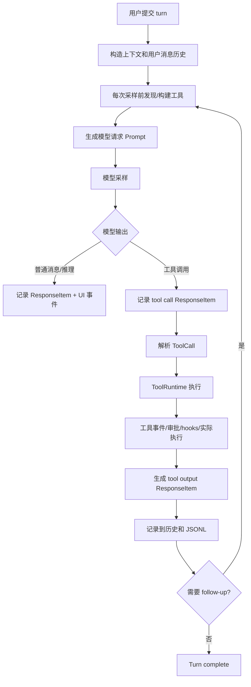
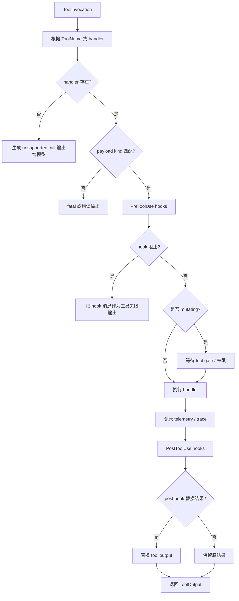
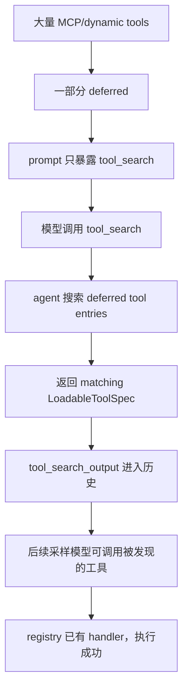

# Turn 期间工具发现、调用与模型交互

这篇笔记解释一次 turn 里工具相关的完整业务逻辑：

- 工具从哪里来。
- 什么时候发现和筛选。
- 怎样暴露给模型。
- 模型怎样请求工具。
- agent 怎样执行工具。
- 工具结果怎样回灌给模型。
- 相关数据类型如何理解。

核心结论：

1. 工具不是一个静态列表，而是每次采样前按当前 turn 状态重新构建。
2. 工具有两层结构：给模型看的 `ToolSpec`，和运行时执行用的 `ToolHandler`。
3. 模型请求工具时，会先产生稳定的 tool call `ResponseItem`，这个调用本身会写入历史。
4. 工具执行完成后，结果会转换成 tool output `ResponseItem`，再进入历史。
5. 如果工具调用意味着 turn 还没结束，agent 会用“工具调用 + 工具结果 + 旧历史”继续后续采样。
6. `event_msg` 负责 UI/日志/审批进度；`response_item` 负责模型可见的调用事实和结果事实。

## 1. 总体流程



从模型角度看，工具调用是一段对话：

```ts
type ModelVisibleToolExchange = [
  ToolCallResponseItem,
  ToolOutputResponseItem,
];
```

从 UI 角度看，同一段过程会产生更多事件：

```ts
type UiToolLifecycle = [
  "item_started or tool_begin event",
  "approval/request event, optional",
  "output delta event, optional",
  "item_completed or tool_end event",
];
```

这两条线要分开理解。

## 2. 工具来源

Turn 期间可用工具来自多个来源：

```ts
type ToolSource =
  | "built_in_tools"
  | "environment_tools"
  | "mcp_tools"
  | "apps_and_connectors"
  | "plugins"
  | "skills"
  | "dynamic_tools"
  | "hosted_model_tools"
  | "tool_search_deferred_tools"
  | "unavailable_dummy_tools";
```

### 2.1 built-in tools

内置工具是 agent 自己实现的能力，例如：

- shell / exec / unified exec。
- apply_patch。
- update_plan。
- request_user_input。
- request_permissions。
- view_image。
- goal tools。
- multi-agent tools。
- MCP resource read/list。

这些工具通常同时有：

- 模型可见的工具说明。
- 本地 handler。
- 权限、sandbox、hooks、事件处理逻辑。

### 2.2 environment tools

如果当前环境允许访问文件系统或命令执行，就会启用环境类工具。

这些工具受配置影响：

```ts
type EnvironmentToolConfig = {
  environmentMode: "none" | "single" | "multiple";
  shellType: "default" | "local" | "unified_exec" | "shell_command" | "disabled";
  applyPatchToolType?: "function" | "freeform";
  execPermissionApprovalsEnabled: boolean;
};
```

业务含义：

- 没有环境能力时，不应把 shell/apply_patch 等工具暴露给模型。
- shell 类型会影响模型看到的工具形态。
- apply_patch 可能是 function tool，也可能是 freeform/custom tool。

### 2.3 MCP tools

MCP server 提供外部工具。turn 期间会从 MCP connection manager 拉取当前所有工具。

抽象结构：

```ts
type McpToolInfo = {
  serverName: string;
  callableNamespace: string;
  namespaceDescription?: string;
  connectorId?: string;
  connectorName?: string;
  tool: {
    name: string;
    description?: string;
    inputSchema: unknown;
  };
};
```

MCP tool 会被转换成 Responses API 的 namespace function tool：

```ts
type ResponsesApiNamespace = {
  type: "namespace";
  name: string;
  description: string;
  tools: ResponsesApiNamespaceTool[];
};

type ResponsesApiNamespaceTool = {
  type: "function";
  name: string;
  description: string;
  strict: boolean;
  parameters: JsonSchema;
};
```

### 2.4 apps/connectors

apps/connectors 本质上也是一类可用能力，通常通过 MCP 工具暴露。

筛选逻辑：

- 如果 apps 功能没开启，不处理 connector。
- 合并已安装 plugin 声明的 apps 和当前 MCP 可访问的 apps。
- 根据配置判断 connector 是否 enabled。
- 当前用户输入、skill 注入内容、显式 app mention 会影响哪些 connector 被本轮直接启用。

抽象结构：

```ts
type AppConnector = {
  id: string;
  name: string;
  isEnabled: boolean;
  installUrl?: string;
  tools: McpToolInfo[];
};
```

### 2.5 plugins 和 skills

plugins/skills 不一定直接等于工具。

它们可能带来：

- 额外 instruction，上下文注入给模型。
- MCP server。
- app connector。
- dependency prompt。
- 可安装/可启用能力的发现信息。

业务逻辑：

- 当前用户输入里显式 `plugin://...` mention，会被解析成本轮 plugin guidance。
- 当前用户输入或 skill instructions 里显式 app mention，会影响本轮可直接暴露的 connector 工具。
- skill dependency 可能触发 MCP dependency prompt/install。

### 2.6 dynamic tools

dynamic tools 是 thread/session 层动态注入的工具定义，通常来自 app-server 或外部产品。

```ts
type DynamicToolSpec = {
  namespace?: string;
  name: string;
  description: string;
  inputSchema: unknown;
  deferLoading: boolean;
};
```

业务含义：

- `deferLoading=false`：工具可以直接出现在模型的 tools 里。
- `deferLoading=true`：工具不直接暴露，通常通过 `tool_search` 找到后再使用。
- dynamic tool 的执行不是本地固定 handler，而是发出 dynamic tool request，等待外部客户端响应。

### 2.7 hosted model tools

有些工具由模型服务侧执行，例如 web search、image generation。

这些工具会出现在 `Prompt.tools`，但不一定由本地 `ToolRuntime` 执行。

模型返回时通常表现为：

```ts
type HostedToolResponseItem =
  | WebSearchCallResponseItem
  | ImageGenerationCallResponseItem;
```

这些 item 会被记录到历史，并转成 UI 事件，但不会进入本地工具 dispatch。

## 3. 每次采样前如何发现工具

工具发现发生在 `run_sampling_request` 里，也就是每次要调用模型前。

这点很重要：同一个 turn 里如果发生工具搜索、用户 steer、connector selection 改变、dynamic tool 状态变化，后续采样会重新构建工具集合。

抽象算法：

```ts
function buildToolsBeforeSampling(state: TurnState): ToolRouter {
  const allMcpTools = listAllMcpTools();
  const loadedPlugins = loadPluginsForConfig();
  const accessibleConnectors = appsEnabled
    ? deriveConnectorsFromMcpToolsAndPlugins(allMcpTools, loadedPlugins)
    : [];

  const discoverableTools = toolSuggestEnabled
    ? listInstallableOrEnableableTools(accessibleConnectors, loadedPlugins)
    : [];

  const explicitlyEnabledConnectors = merge(
    connectorsMentionedByCurrentInput,
    connectorsSelectedEarlierInSession,
    connectorsMentionedBySkillInstructions,
  );

  const directAndDeferredMcp = decideDirectVsDeferredMcpTools(
    allMcpTools,
    accessibleConnectors,
    explicitlyEnabledConnectors,
  );

  const unavailableDummyTools = detectPreviouslyCalledButNowMissingTools(history);

  return buildToolRouter({
    builtInToolsFromConfig,
    directMcpTools: directAndDeferredMcp.direct,
    deferredMcpTools: directAndDeferredMcp.deferred,
    discoverableTools,
    dynamicTools,
    unavailableDummyTools,
  });
}
```

## 4. direct tools 和 deferred tools

MCP/app 工具可能很多。如果全量塞进 prompt，会浪费大量 token，也会干扰模型选择。

因此会做 direct/deferred 拆分。

```ts
type McpToolExposure = {
  directTools: McpToolInfo[];
  deferredTools?: McpToolInfo[];
};
```

direct tools：

- 直接放进 `Prompt.tools`。
- 模型本轮可以直接调用。

deferred tools：

- 不直接放进 `Prompt.tools`。
- 注册 handler，保证后续如果模型通过搜索结果调用它时能执行。
- 通过 `tool_search` 向模型按需返回匹配工具。

触发 deferred 的典型条件：

- 工具数量超过阈值。
- 配置要求总是 defer MCP tools。
- 工具属于未显式启用的 app connector。

用户或 skill 显式 mention 的 connector，会尽量变成 direct tools。

## 5. ToolRouter：模型工具和运行时 handler 的桥

`ToolRouter` 是 turn 期间工具系统的核心对象。

```ts
type ToolRouter = {
  registry: ToolRegistry;
  specs: ConfiguredToolSpec[];
  modelVisibleSpecs: ToolSpec[];
  parallelMcpServerNames: Set<string>;
};
```

它同时解决两个问题：

- 给模型看什么工具。
- 模型真的调用时，由谁执行。

### 5.1 ToolSpec：给模型看的工具定义

```ts
type ToolSpec =
  | FunctionToolSpec
  | NamespaceToolSpec
  | ToolSearchSpec
  | LocalShellSpec
  | ImageGenerationSpec
  | WebSearchSpec
  | FreeformToolSpec;

type FunctionToolSpec = {
  type: "function";
  name: string;
  description: string;
  strict: boolean;
  defer_loading?: boolean;
  parameters: JsonSchema;
};

type NamespaceToolSpec = {
  type: "namespace";
  name: string;
  description: string;
  tools: FunctionToolSpec[];
};

type FreeformToolSpec = {
  type: "custom";
  name: string;
  description: string;
  format: {
    type: string;
    syntax: string;
    definition: string;
  };
};
```

### 5.2 ToolRegistry：运行时执行表

```ts
type ToolRegistry = {
  handlersByToolName: Map<ToolName, ToolHandler>;
};

type ToolName = {
  namespace?: string;
  name: string;
};
```

注意：

- `modelVisibleSpecs` 是给模型的。
- `registry` 里可以有一些模型当前看不到的 handler，例如 deferred MCP tools。
- 这样模型通过 `tool_search` 发现并调用某个 deferred tool 后，本地仍然知道怎么执行。

## 6. Prompt 里工具如何给模型

每次采样请求会构造一个 `Prompt`：

```ts
type Prompt = {
  input: ResponseItem[];
  tools: ToolSpec[];
  parallelToolCalls: boolean;
  baseInstructions: BaseInstructions;
  personality?: string;
  outputSchema?: unknown;
  outputSchemaStrict: boolean;
};
```

其中：

- `input` 是历史整理后的模型输入。
- `tools` 来自 `router.modelVisibleSpecs()`。
- `parallelToolCalls` 由模型能力决定。
- `outputSchema` 是最终输出约束，不是工具定义。

模型看到工具后，可以选择：

- 不调用工具，直接输出消息。
- 调用一个或多个工具。
- 使用 hosted tools。
- 使用 `tool_search` 找 deferred tools。
- 在 plan mode 下先产出 plan。

## 7. 模型如何表达工具调用

模型输出的工具调用会进入 `ResponseItem`。

```ts
type ToolCallResponseItem =
  | FunctionCallResponseItem
  | CustomToolCallResponseItem
  | LocalShellCallResponseItem
  | ToolSearchCallResponseItem
  | WebSearchCallResponseItem
  | ImageGenerationCallResponseItem;

type FunctionCallResponseItem = {
  type: "function_call";
  name: string;
  namespace?: string;
  arguments: string;
  call_id: string;
};

type CustomToolCallResponseItem = {
  type: "custom_tool_call";
  call_id: string;
  name: string;
  input: string;
  status?: string;
};

type LocalShellCallResponseItem = {
  type: "local_shell_call";
  call_id?: string;
  status: string;
  action: {
    type: "exec";
    command: string[];
    working_directory?: string;
    timeout_ms?: number;
  };
};

type ToolSearchCallResponseItem = {
  type: "tool_search_call";
  call_id?: string;
  status?: string;
  execution: "client" | string;
  arguments: unknown;
};
```

当模型 output item 完整结束时：

1. agent 判断这个 `ResponseItem` 是否是本地可执行工具调用。
2. 如果是，先把 tool call `ResponseItem` 记录进历史和 JSONL。
3. 再启动工具执行。
4. 标记 `needs_follow_up=true`。

为什么先记录 tool call？

因为工具结果要和调用成对存在。后续模型采样需要知道：

- 模型刚才请求了哪个工具。
- 参数是什么。
- 对应的工具结果是什么。

## 8. ToolCall：内部执行请求

模型的 `ResponseItem` 会被转换成内部 `ToolCall`：

```ts
type ToolCall = {
  toolName: ToolName;
  callId: string;
  payload: ToolPayload;
};

type ToolPayload =
  | { type: "function"; arguments: string }
  | { type: "tool_search"; arguments: SearchToolCallParams }
  | { type: "custom"; input: string }
  | { type: "local_shell"; params: ShellToolCallParams }
  | { type: "mcp"; server: string; tool: string; rawArguments: string };
```

转换规则：

| 模型输出 | 内部 payload |
| --- | --- |
| `function_call` 且命中 MCP tool | `ToolPayload.Mcp` |
| 普通 `function_call` | `ToolPayload.Function` |
| `custom_tool_call` | `ToolPayload.Custom` |
| `local_shell_call` | `ToolPayload.LocalShell` |
| `tool_search_call` 且 `execution == "client"` | `ToolPayload.ToolSearch` |
| web search / image generation | hosted tool item，不走本地 `ToolCall` |

## 9. ToolRuntime：并发、取消和结果包装

工具执行由 `ToolCallRuntime` 管理。

```ts
type ToolCallRuntime = {
  router: ToolRouter;
  session: Session;
  turnContext: TurnContext;
  tracker: TurnDiffTracker;
  parallelExecutionLock: ReadWriteLock;
};
```

它负责：

- 判断工具是否支持并发。
- 为工具调用创建取消 token。
- 将不支持并发的工具串行化。
- 捕获工具错误并转换成给模型看的失败输出。
- 处理用户中断时的 aborted output。

并发规则：

```ts
function concurrencyMode(call: ToolCall): "parallel" | "exclusive" {
  if (call.payload.type === "mcp") {
    return mcpServerAllowsParallel(call.payload.server) ? "parallel" : "exclusive";
  }
  return configuredToolSupportsParallel(call.toolName) ? "parallel" : "exclusive";
}
```

## 10. ToolHandler：每个工具自己的业务执行器

每个工具 handler 负责自己的参数解析、权限、事件和结果。

```ts
type ToolHandler = {
  toolName: ToolName;
  spec?: ToolSpec;
  kind: "function" | "mcp";
  supportsParallelToolCalls: boolean;

  isMutating(invocation: ToolInvocation): Promise<boolean>;
  preToolUsePayload(invocation: ToolInvocation): PreToolUsePayload | undefined;
  postToolUsePayload(invocation: ToolInvocation, result: ToolOutput): PostToolUsePayload | undefined;
  handle(invocation: ToolInvocation): Promise<ToolOutput>;
};

type ToolInvocation = {
  session: Session;
  turn: TurnContext;
  cancellationToken: CancellationToken;
  tracker: TurnDiffTracker;
  callId: string;
  toolName: ToolName;
  source: "direct" | "code_mode";
  payload: ToolPayload;
};
```

通用 dispatch 逻辑：



## 11. ToolOutput：工具结果怎样变成模型输入

工具 handler 返回 `ToolOutput`，最后会转换成 `ResponseInputItem`。

```ts
type ToolOutput = {
  logPreview(): string;
  successForLogging(): boolean;
  toResponseItem(callId: string, payload: ToolPayload): ResponseInputItem;
};

type ResponseInputItem =
  | FunctionCallOutputInputItem
  | CustomToolCallOutputInputItem
  | McpToolCallOutputInputItem
  | ToolSearchOutputInputItem;

type FunctionCallOutputInputItem = {
  type: "function_call_output";
  call_id: string;
  output: FunctionCallOutputPayload;
};

type CustomToolCallOutputInputItem = {
  type: "custom_tool_call_output";
  call_id: string;
  name?: string;
  output: FunctionCallOutputPayload;
};

type ToolSearchOutputInputItem = {
  type: "tool_search_output";
  call_id: string;
  status: string;
  execution: "client";
  tools: unknown[];
};
```

`FunctionCallOutputPayload` 的 wire 形态可以是文本，也可以是结构化 content items：

```ts
type FunctionCallOutputPayload = {
  body: string | FunctionCallOutputContentItem[];
  success?: boolean;
};

type FunctionCallOutputContentItem =
  | { type: "input_text"; text: string }
  | { type: "input_image"; image_url: string; detail?: string };
```

工具结果进入历史时，会再转换成稳定的 `ResponseItem`：

```ts
type ToolOutputResponseItem =
  | { type: "function_call_output"; call_id: string; output: FunctionCallOutputPayload }
  | { type: "custom_tool_call_output"; call_id: string; name?: string; output: FunctionCallOutputPayload }
  | { type: "tool_search_output"; call_id?: string; status: string; execution: string; tools: unknown[] };
```

## 12. 工具执行完成后如何继续采样

工具执行是异步的。

流程：

1. 模型输出 tool call。
2. agent 记录 tool call `ResponseItem`。
3. agent 启动工具 future。
4. 当前模型 stream 结束或需要等待工具时，drain in-flight 工具。
5. 工具结果转换成 `ResponseInputItem`。
6. 再转换成 `ResponseItem` 并记录到历史。
7. 如果 `needs_follow_up=true`，重新构造 prompt 并再次采样。

```ts
type FollowUpSamplingHistory = [
  "...older history",
  ToolCallResponseItem,
  ToolOutputResponseItem,
];
```

下一次模型看到的是：

- 它刚才调用了什么工具。
- 工具返回了什么。
- 当前上下文是否有新 diff。
- 是否有 pending input。

这就是 agent 能“用工具做事然后继续推理”的核心。

## 13. tool_search 的特殊逻辑

`tool_search` 是工具发现工具。

它解决的问题：

- 当前 prompt 不能放太多 MCP/dynamic tools。
- 模型需要按需搜索可用工具。

```ts
type SearchToolCallParams = {
  query: string;
  limit?: number;
};

type ToolSearchOutput = {
  tools: LoadableToolSpec[];
};

type LoadableToolSpec =
  | FunctionToolSpec
  | NamespaceToolSpec;
```

业务流程：



注意：

- deferred tool 不直接进 `Prompt.tools`。
- 但它的 handler 会注册到 registry。
- `tool_search_output` 是模型可见历史，告诉模型搜索结果。

## 14. request_plugin_install 的特殊逻辑

`request_plugin_install` 不是普通业务工具，而是“请求用户安装/启用能力”的工具。

它出现的条件：

- tool suggest 开启。
- 当前有可安装或可启用的 plugin/connector。
- 当前客户端支持这类请求。

模型使用它时，实际是向用户发出安装/启用请求。

```ts
type RequestPluginInstallArgs = {
  tool_type: "connector" | "plugin";
  action_type: "install" | "enable";
  tool_id: string;
  suggest_reason: string;
};
```

安装/启用完成后，后续采样会重新发现 MCP tools/connectors/plugins，新的能力才可能成为 direct tool 或 searchable tool。

## 15. hosted tools 的特殊逻辑

web search / image generation 由模型服务侧执行。

模型返回的是已完成的 hosted tool item：

```ts
type WebSearchCallResponseItem = {
  type: "web_search_call";
  id?: string;
  status?: string;
  action?: unknown;
};

type ImageGenerationCallResponseItem = {
  type: "image_generation_call";
  id: string;
  status: string;
  revised_prompt?: string;
  result: string;
};
```

这些 item：

- 会被记录成 `response_item`。
- 会转换成 UI item/event。
- 不会进入本地 `ToolRuntime` dispatch。

## 16. 权限、审批、hooks 和 sandbox

工具调用不只是函数调用，它可能触发安全和产品控制流。

```ts
type ToolControlFlow =
  | "pre_tool_use_hook"
  | "approval_request"
  | "permission_request"
  | "sandbox_execution"
  | "tool_gate_for_mutating_operations"
  | "post_tool_use_hook"
  | "after_tool_use_hook";
```

典型语义：

- `pre_tool_use_hook` 可以阻止工具执行，并把阻止原因作为工具输出给模型。
- `approval_request` 会让 UI 请求用户批准。
- `sandbox_execution` 限制工具能访问的文件/网络/系统能力。
- `post_tool_use_hook` 可以追加上下文，或替换工具输出。
- mutating 工具会等待 tool gate，避免在不合适时修改环境。

这些过程会产生 `event_msg`，但最终影响模型的是对应 tool output `ResponseItem`。

## 17. 错误处理

工具错误分三类：

```ts
type ToolErrorKind =
  | "respond_to_model"
  | "fatal"
  | "aborted";
```

| 错误类型 | 处理方式 |
| --- | --- |
| 参数解析失败、unsupported tool、hook 阻止 | 转成失败 tool output，回给模型继续推理 |
| 缺少必要 call id | 记录原 tool call，再构造错误 output |
| fatal | 当前采样/turn 失败 |
| 用户中断 | 构造 aborted output 或 turn aborted |

设计意图：

- 可恢复错误尽量回灌给模型，让模型自己修正。
- 系统级错误才中断 turn。

## 18. 和持久化/后续历史的关系

工具相关持久化顺序通常是：

```text
response_item: model tool call
event_msg: tool/item begin, optional
event_msg: approval/request/delta, optional
event_msg: tool/item end, optional
response_item: tool output
```

但后续模型采样主要依赖：

```ts
type ModelRelevantToolHistory = {
  call: ToolCallResponseItem;
  output: ToolOutputResponseItem;
};
```

`event_msg` 只负责：

- UI 展示工具进度。
- 审批/权限/用户输入交互。
- thread read 回放。
- 日志和审计。

## 19. 对 Web Word agent 的设计建议

如果映射到 Web Word，建议这样设计：

```ts
type WebWordToolSystem = {
  toolCatalog: "所有可安装/可发现/可启用工具";
  activeToolSpecs: "当前采样直接给模型看的工具";
  deferredToolIndex: "可搜索但不直接暴露的工具";
  toolRegistry: "运行时 handler 表";
  toolEvents: "UI/日志/审批事件";
  modelHistory: "tool call + tool output 的稳定历史";
};
```

Web Word 工具示例：

```ts
type WebWordTool =
  | "read_document"
  | "replace_range"
  | "insert_comment"
  | "apply_style"
  | "track_changes"
  | "search_document"
  | "export_docx"
  | "ask_user";
```

建议：

- 文档读写工具必须区分 read-only 和 mutating。
- mutating 工具要支持审批、预览 diff、撤销。
- 大文档内容不要全部塞进工具输出；输出应包含摘要、范围、版本号、必要片段。
- 工具调用必须有 `callId`，并在模型历史里保存 call/output 对。
- UI 的工具进度事件不要当成模型历史。
- 工具目录可以很大，但直接暴露给模型的工具要少；其余走 tool_search。
- 外部业务系统工具可以用 dynamic tools 模式，调用时发 server request，结果回灌为 tool output。

## 20. 源码对照

| 主题 | 源码入口 |
| --- | --- |
| 每次采样前构造工具 | `codex-rs/core/src/session/turn.rs` |
| Prompt tools 字段 | `codex-rs/core/src/client_common.rs` |
| ToolRouter / ToolCall 解析 | `codex-rs/core/src/tools/router.rs` |
| ToolRuntime 并发、取消、错误包装 | `codex-rs/core/src/tools/parallel.rs` |
| ToolRegistry / ToolHandler dispatch | `codex-rs/core/src/tools/registry.rs` |
| 工具规格构建 | `codex-rs/core/src/tools/spec.rs`, `codex-rs/core/src/tools/spec_plan.rs` |
| MCP direct/deferred 暴露 | `codex-rs/core/src/mcp_tool_exposure.rs` |
| tool_search handler | `codex-rs/core/src/tools/handlers/tool_search.rs` |
| dynamic tool handler | `codex-rs/core/src/tools/handlers/dynamic.rs` |
| 工具调用 stream 处理 | `codex-rs/core/src/session/turn.rs`, `codex-rs/core/src/stream_events_utils.rs` |
| tool call/output 数据结构 | `codex-rs/protocol/src/models.rs` |
| ToolSpec 数据结构 | `codex-rs/tools/src/tool_spec.rs`, `codex-rs/tools/src/responses_api.rs` |
